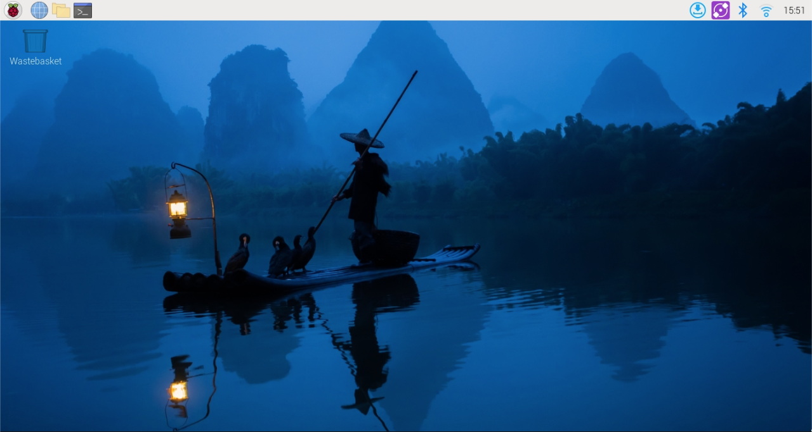

## Remote Access Using Raspberry Pi Connect

Raspberry Pi Connect allows you to securely access your Raspberry Pi from anywhere using a web browser. It provides two main features: **remote shell (command-line access)** and **screen sharing (desktop access)**. Once set up, the service runs automatically in the background and reconnects on every boot, so you only need to configure it once.

To use Raspberry Pi Connect, you will need a **Raspberry Pi ID**, which is a free account provided by Raspberry Pi.

------

## Creating a Raspberry Pi ID

If you do not already have a Raspberry Pi ID:

1. Go to: https://connect.raspberrypi.com
2. Click **Sign in**.
3. Choose **Create an account**.
4. Enter your email address and create a password.
5. Confirm your email address when prompted.

Once you’ve created your account, you can use it to link one or more Raspberry Pis.

------

## Enabling Raspberry Pi Connect on Your Pi

Start the Raspberry Pi Connect service for your current user:

```bash
rpi-connect on
```

Sign in:

```bash
rpi-connect signin
```

You should see something like this:

```bash
Complete sign in by visiting https://connect.raspberrypi.com/verify/XXXX-XXXX
```

Visit the verification URL on any device and sign in with your Raspberry Pi ID to link your device with your Connect account. You will get an email to confirm.

Name your device.

Connect to your Raspberry Pi via `Screen sharing` or `Remote shell` (command line).

If you connect via screen sharing, you will see the Raspberry Pi OS desktop appear.



If you connect via remote shell, you will see this prompt:

```bash
<user>@<hostname>:~ $
```

