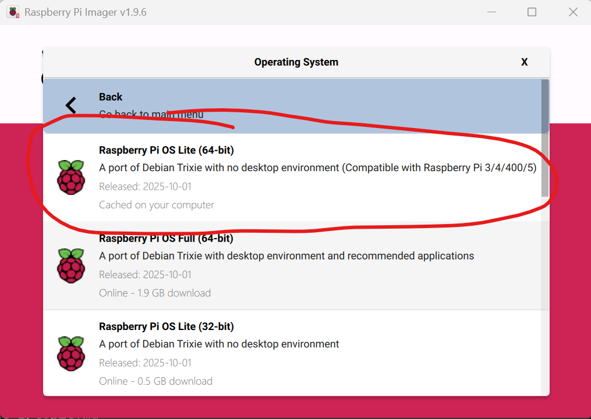

# Raspberry Pi OS
  

[Raspberry Pi OS](https://www.raspberrypi.org/downloads/raspberry-pi-os/) is a Linux operating system designed and optimised specifically for the Raspberry Pi. It is a version of the Debian Linux operating system and has the same heratige as Ubuntu.   
In this section of the lab you will download and install Raspberry Pi OS on a SD card.

## Installing Raspberry Pi OS on SD Card

This and future labs were developed using the **Raspberry Pi OS (64-bit) Lite**. 
**NOTE:** If you intend to use your Pi with a Screen/Desktop then opt for the Desktop version.

+ Insert a microSD card into your computer.

+ Download, install and run [**Raspberry Pi Imager**](https://www.raspberrypi.com/software/). 

+ Select your Raspberry Pi Device

+ Click the **Choose OS** button.

+ In the menu, select Raspberry Pi OS(other) and select Raspberry Pi (lite):  
  
  
  This is a smaller, cut down version of the OS that installs relatively quick. It has no desktop. **If you wish, you can install the full version if you intend to the desktop and operate it as a "regular" computer.**
  
+ Click Choose Storage. You should see your SD Card in the list. Select your SD card from the list.  
  

+ When prompted to apply OS customisation, select "**EDIT SETTINGS**". This will allow you to configure Wifi, login, and Secure Shell (SSH)
  
+ In the general tab, set you hostname to *"HDipRPi"*, username and password to something memorable (**don't forget your password or you'll have to do it all again.**) . And set your Wifi settings to whatever you have at home (SSID is your wifi network name and password - **IT IS CASE SENSITIVE**). 
  It is important to do this correctly if you are connecting with the "Headless" approach. 
  

+ Select the Services tab and enable SSH to on and select "Use password authentication." 

+ Click "**Save**", an then "**Yes**" when prompted to apply OS customisation settings. You my be asked if it's OK to overwrite the SD card - it is.

+ The imager should now begin writing the OS to the SD card

## Boot the Pi

- Eject the SD card and put it into the unplugged RPi. 
- Now power up the RPi - it should automatically connect to the the WiFi network. But how do you know if it's connected? You'll have to find it on the local network...

## Exercise

Before moving on, try to come up with your own solution to finding and connecting to the RPi. If everything has worked out so far you now know the following: 

+ The host name is "HDipRpi.local"(or whatever you configured it to be)
+ The RPi should have acquired an IP address on the same local network as your computer (**Make sure your computer/laptop is connected to the same wifi network as your RPi!**)
+ It's configured for SSH connection
+ All RPis have the same manufacturers MAC address section, so the MAC will probably start with **"88:A2:9E:..."** or one listed [here](https://www.netify.ai/resources/macs/brands/raspberry-pi)

There is more than one solution to this problem. Based on what we've covered in the Module so far, see if you can come up with more than one before moving on...