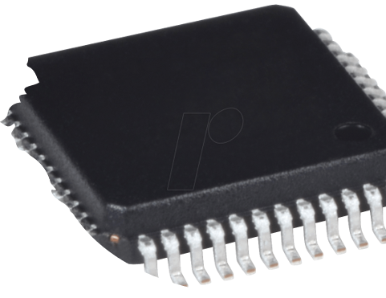
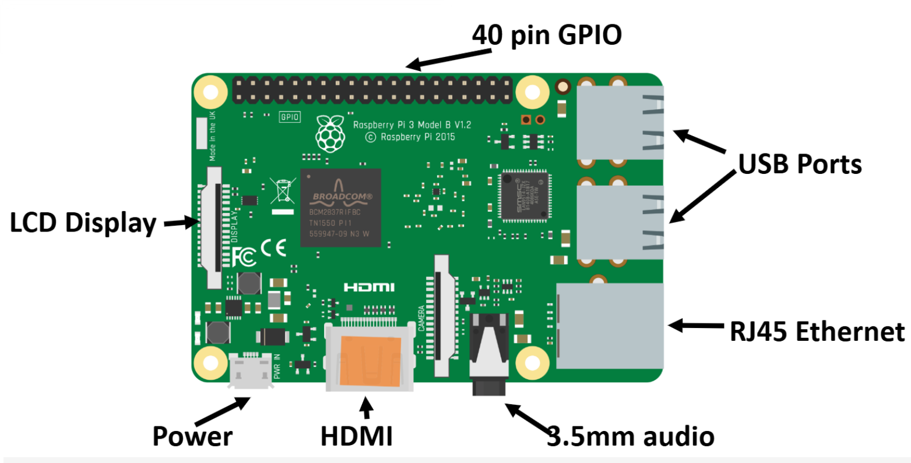
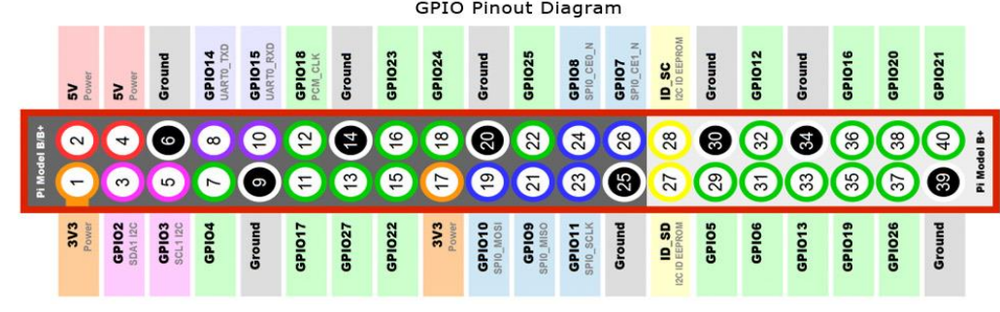
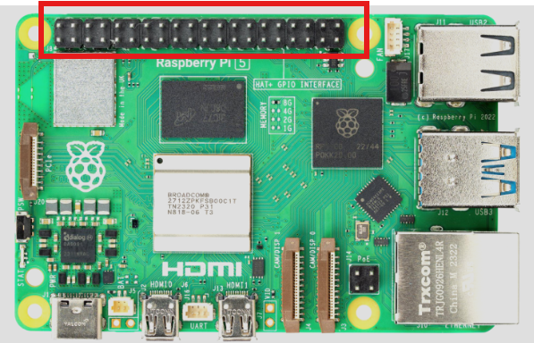
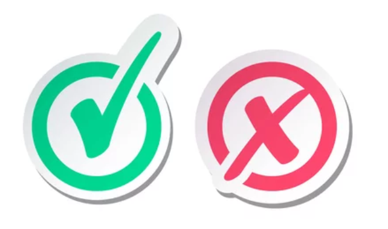
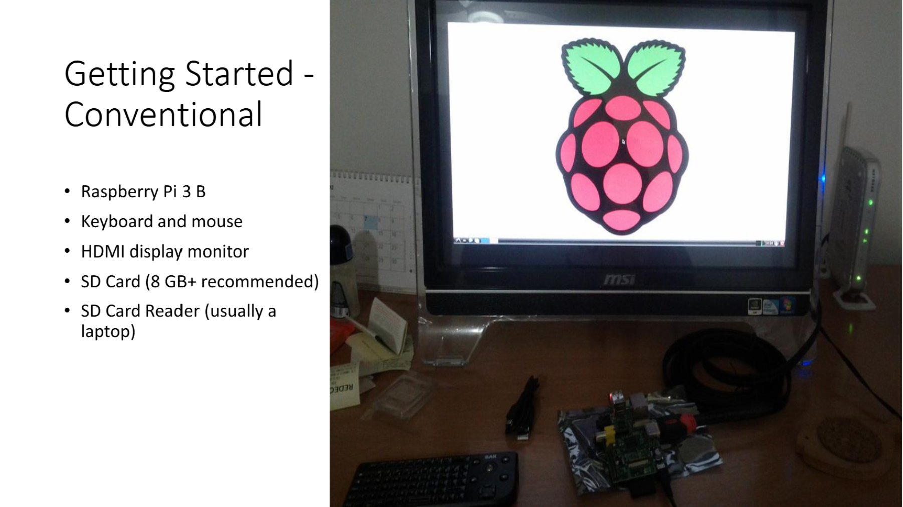

# Single Board Computers
Raspberry Pi · SenseHAT 

### Frank Walsh 
2025

---

# Agenda
+ Single Board Computer (SBC)
    + Example: Raspberry Pi
+ What are they?
+ SBC vs Microcrontrollers
+ Raspberry Pi(RPi) Introduction
+ Getting Started with the RPi
    + Conventional vs Headless
+ Connecting Hardware
+ SenseHAT

---
# Single Board Computer(SBC)

+ A complete computer on a single board CPU, RAM, storage, and I/O ports
+ Runs a full-fledged operating system 
    + Linux distributions
+ Examples:
    + Raspberry Pi, Rock Pi 4, BeagleBone, Odroid
+ Useful for embedded applications, prototyping, and as an affordable alternative to traditional PCs
+ Raspberry Pi is one of the most recognized SBCs in the world
    

---
# Aside: What is a Microcontroller? 
- A compact circuit designed for specific operations in embedded systems.
- Contains a CPU, small RAM, storage, and operates without a full OS.
- Executes pre-programmed tasks, ideal for hardware interactions.

- Real time/near Real time operation
    - process tasks within strict timing constraints, often for tasks where timing is critical
    - Example Application: **anti-lock braking system (ABS)**
   
    

---
# Best of Both Worlds

"Combines a Linux® Debian-capable Qualcomm® Dragonwing™ QRB2210 microprocessor with a real-time STM32U585 microcontroller (MCU). It’s Arduino, it’s a computer, it’s anything you want to build."

---

# Raspberry Pi

+ Low cost, single board computer
+ Linux OS
+ Same features as most laptops/workstations
- Developed by the **Raspberry Pi Foundation** to promote computer science education.
- Popular for DIY, education, and professional projects.

---

# Raspberry Pi History
- First launched in **2012** by the Raspberry Pi Foundation in the UK.
- Inspired by BBC Micro
- Aimed to make computing accessible to everyone.
- Evolved from the original Raspberry Pi Model B to the latest Raspberry Pi 4 and Raspberry Pi 400.

---

# Raspberry Pi Models
- **Raspberry Pi 4**:  2GB, 4GB, or 8GB of RAM
- **Raspberry Pi 5**:  4GB or 8GB of RAM, significantly faster 2.4GHz quad-core Cortex-A76 CPU
- **Raspberry Pi Zero**: Ultra-compact.embedded/ 
lightweight applications;
- **Raspberry Pi 400**: Keyboard-integrated model containing Pi 4-class hardware, designed for an all-in-one desktop computing experience.

---

# GPIO Pins and Hardware Control
- **GPIO (General Purpose Input/Output)** pins allow control over electronic devices.
- Used for:
  - Sensors
  - LEDs
  - Motors
  - Cameras
- Makes Raspberry Pi ideal for robotics and IoT projects.

---

# Popular Applications of Raspberry Pi
- **Education**: Teaching programming and computer science.
- **DIY Projects**: Smart home devices, weather stations, robots, etc.
- **Media Centers**: Turn your TV into a smart media center with software like **Kodi**.
- **Gaming**: Retro gaming consoles using **RetroPie**.

---

---
# Pros and Cons of Raspberry Pi
- **Pros**:
  - Affordable
  - Versatile and customizable
  - Large community and resources
- **Cons**:
  - Limited processing power compared to full desktops and laptops
  - Usually need to get more stuff (enclosure, HATs, LCD Screens, cables)
  
---
# SenseHAT
+ The Sense HAT (Hardware Attached on Top) is an add-on board for the Raspberry Pi featuring a collection of sensors and a programmable LED matrix
- **LED Matrix**: An 8x8 RGB LED matrix for display and visual output.
- **Sensors**: 
  - Temperature
  - Humidity
  - Pressure
  - Gyroscope (orientation)
  - Accelerometer (movement)
  - Magnetometer (compass)
- **Joystick**: Mini-joystick for user input.

---
# Attaching the SenseHAT

See the [Lab](https://tutors.dev/lab/setu-hdip-comp-sci-2024-comp-sys/topic-08-week8/book-3)

---

---

---