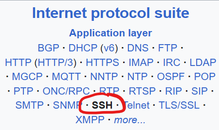
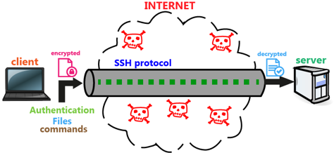
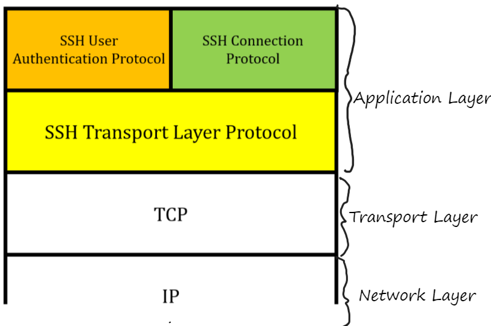
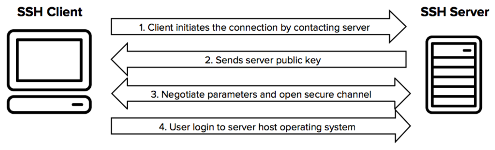
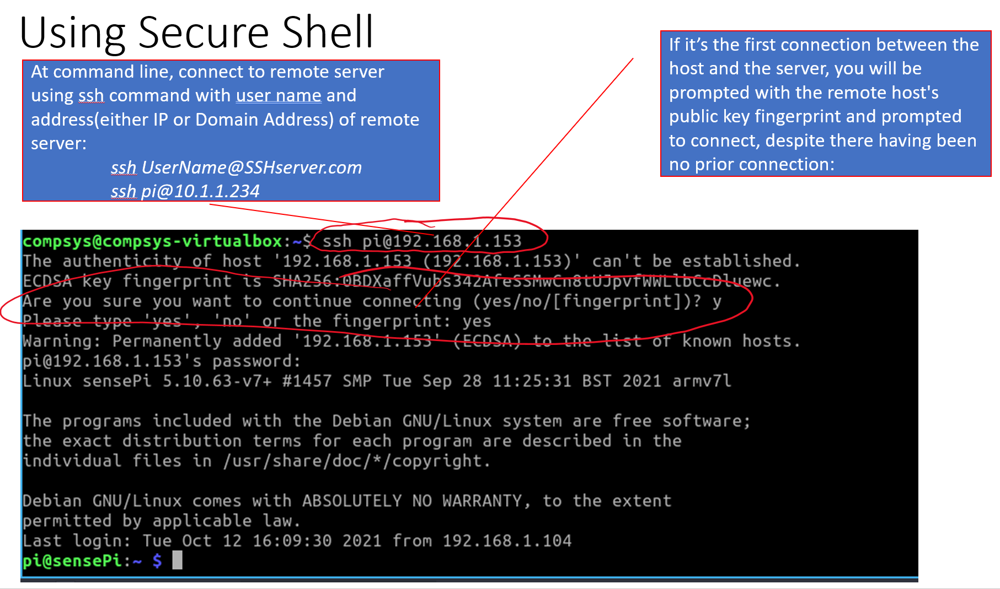

# SSH (Secure Shell)
SSH Protocol · SSH to RPi 
### Frank Walsh 
2024

---

# Introduction to SSH
- **SSH** (Secure Shell) is a protocol that provides a secure way to access a remote computer or server.
- It encrypts the communication between your device and the remote device, ensuring data security.
- SSH is widely used for 
    - Accessing remote hosts/servers
    - Secure File Transfer (SCP and SFTP)
    - Access to Cloud Services and Virtual Machines
    - Tunneling and Port Forwarding 

---
# Why SSH is Important
+ Need for security in remote communication
  + Telnet was its predecessor. Not good enough for today
+ Vulnerability of unencrypted protocols(last lab - UDP payload unencrypted)
+ SSH allow you to:
  + protecting sensitive data
  + ensure authentication
  + preventing unauthorized access.

---
# How SSH Works
+ Client-Server model
+ SSH operates over TCP, typically using  port 22
+ Components: 
    + SSH client
    + SSH server

---
# SSH Protocol

+ Transport layer Protocol: Handles encryption
+ User authentication protocol: Verifies the client’s identity
+ Connection protocol: Manages channels for services like shell, SFTP, port forwarding

---
# How SSH Works - Encryption
- SSH uses **public-key cryptography** for authentication and **encryption**
  - **Encryption**: SSH encrypts data transmitted over a network, making it unreadable to unauthorised entities
  - **Authentication**: SSH verifies the identity of both the client and the server, including password or public-key authentication

  
---

# SSH Authentication Protocols

+ Password-based authentication
  + You start an SSH connection using a command like ssh user@hostname, the SSH client sends a connection request to the server
  + The server responds by asking for the user's identity, which, in this case, is verified with a password.
+ Public key authentication:
  - SSH uses a **key pair**: a public key and a private key.
  - The **public key** is stored on the server; the **private key** stays with the client.
  -  When connecting, the server verifies the private key without transmitting it, ensuring security.
---
# SSH Availability
+ SSH is present on most Operating Systems
  + MAC, Linux, Windows 10+
+ SSH widely used in Cloud Computing
Access remote VMs in the cloud using SSH
  + You will see it again in Dev Ops
https://www.youtube.com/watch?v=Atbl7D_yPug

---

# Advantages of Using SSH
- **Security**: SSH encrypts data to protect it from eavesdropping.
- **Authentication**: Uses key-based authentication, reducing reliance on passwords.
- **Convenience**: Provides command-line access and allows file transfers.
- **Port Forwarding**: Enables secure tunneling for other applications (e.g., databases).

---

# Setting Up SSH on Raspberry Pi
- Do it when you install the OS ([see Lab](https://tutors.dev/lab/setu-hdip-comp-sci-2024-comp-sys/topic-08-week8/book-3/01))
- If using RPi as Desktop: 
  - Open **Raspberry Pi Configuration** and enable SSH in the **Interfaces** tab.
  - Alternatively, use the command: `sudo systemctl enable ssh` and `sudo systemctl start ssh`.
- Note the IP address of your Raspberry Pi, which you'll need to connect via SSH.

---

# Connecting to Raspberry Pi via SSH (Command Line)
- Open the terminal on your computer.
- Use the SSH command: `ssh pi@<RaspberryPi_IP>`, replacing `<RaspberryPi_IP>` with your Pi's IP address.
- Accept the SSH key fingerprint the first time you connect.
- Enter your **password** when prompted. You are now connected to the Raspberry Pi.

---

---
# Connecting to Raspberry Pi Using SSH in VS Code
- Open **Visual Studio Code**.
- Install the **Remote - SSH** extension from the Extensions Marketplace.
- Click on **Remote Explorer** in the sidebar, then click **SSH Targets** and **Add New SSH Host**.
- Enter `ssh pi@<RaspberryPi_IP>` to connect to your Raspberry Pi, replacing `<RaspberryPi_IP>` with the actual IP address.

---

# Using SSH with VS Code
- After adding the SSH host, select it from the **Remote Explorer** sidebar.
- VS Code will open a terminal and authenticate via SSH to your Raspberry Pi.
- You can now access files, run scripts, and use a full development environment on your Raspberry Pi.

---

# SSH Best Practices
- Use **SSH keys** instead of passwords for enhanced security
  - OK to use passwords for now 
- Change the default SSH port from **22** to reduce unauthorised access attempts.
- Regularly update SSH software on both client and server.
- Disable root login over SSH to prevent potential security breaches.

---

# End of Presentation
