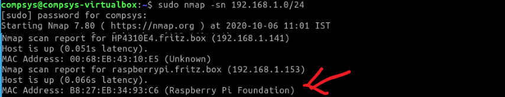

# Where's my RPi?
So to use the RPi in headless mode, you will need to find its IP address. To do this, we'll use the fact that we know the host name and the MAC address pattern. Here are a few solutions you can try(you need only pick one):

## 1. Use MAC address
From networking modules,  you know that the first 3 bytes of the MAC address is the [OUI](https://en.wikipedia.org/wiki/Organizationally_unique_identifier) and indicates the manufacturer/source of the device. In this case, for the Pi it will be either ``b8:27:eb:...`` or ``dc:a6:32:...``.  
So one thing you can do is build up the arp cache on your computer by pinging every possible IP address on your network. If we do this, then the ARP table on your machine should contain the RPi MAC. Remember we used ``nmap`` from week4, lab1 too "see" the devices on your LAN. We can repeat the search to get a list, hopefully with the RPi in it:

- On the command line, run the following command replacing ``<YOUR_NETWORK>`` with the correct Network and subnet mask for your LAN (check it using ipconfig/ifconfig, probably be something like ``192.168.0.0/24``).  

~~~bash
nmap -sn <YOUR_NETWORK>
~~~
You should get a result similar to the following with the MAC and associated IP addresses. 

Locate and record the RPi IP address.(it may take a while for the RPi to boot so try again if it's not there initially)

## 2. Use the router 
If you have administrator rights to your home router and can access the router management page then there usually is a facility to list all connected devices, including their host name and MAC address. As there are many home routers out there, how you access the network connection data will differ in each case.

## 3. Do it your own way

There are other tools and techniques for finding devices on a network. If the above doesn't work but you find an alternative solution, or what you think is a better solution, please share on Slack!
