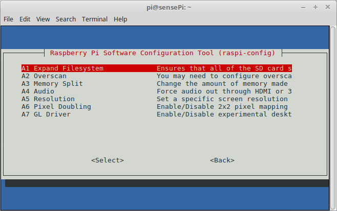

# Raspi-Config

Now that you have connected to the RPi you can use the ``raspi-config`` utility to further configure the RPi.

+ At the command prompt in the the RPi SSH session, enter ``sudo raspi-config``. This will show the following:   

### Expand rootfs
Typically, Raspberry Pi OS images are 2 GB. When you copy the image to a larger SD card then a large portion of the  card may be left unused. To make this available to Raspberry Pi OS, and the apps installed on the RPi, you can expand it to  fill the rest of the SD card.  

+ In the Raspi-config tool, select Advanced Options->Expand Filesystem

  

You should be informed that the resize will take place on the next reboot of the RPi.

