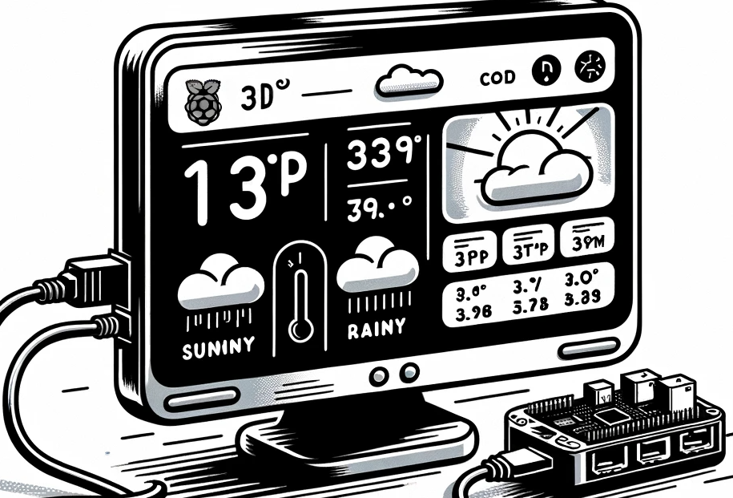

# Connect to the Internet using MQTT

The IoT device needs to be coded to connect and communicate. A MQTT broker (*test.mosquitto.org*) can be used to send telemetry values with the temperature reading, and receive commands to control an actuator.



In this step, you will connect your virtual IoT device to an MQTT broker.

## Install the MQTT client package

To communicate with the MQTT broker, you need to install an MQTT library pip package either on your Pi, or in your virtual environment if you are using a virtual device.

### Task

Install the MQTT pip package

1. Open the *sensor* project in VS Code(using Remote SSH) or otherwise from the last lab.

1. Run the following command to install the MQTT pip package:

    ```sh
    pip install "paho-mqtt<2.0.0"
    ```

## Code the device

1. Add the following import to the top of the `app.py` file:

    ```python
    import paho.mqtt.client as mqtt
    ```

    The `paho.mqtt.client` library allows your app to communicate over MQTT.

1. Add the following code after the definitions of the ``seeed_dht`` sensor:

    ```python
    id = '<ID>'

    client_name = id + '_temp_sensor'
    ```

    Replace `<ID>` with a unique ID that will be used the name of this device client, and later for the topics that this device publishes and subscribes to. The *test.mosquitto.org* broker is public and used by many people, including other students working through this assignment. Having a unique MQTT client name and topic names ensures your code won't clash with anyone else's. You will also need this ID when you are creating the server code later in this assignment.

    > 💁 You can use a website like [GUIDGen](https://www.guidgen.com) to generate a unique ID, or just come up with your own

    The `client_name` is a unique name for this MQTT client on the broker.

1. Add the following code below this new code to create an MQTT client object and connect to the MQTT broker:

    ```python
    mqtt_client = mqtt.Client(client_name)
    mqtt_client.connect('test.mosquitto.org',1883)
    
    mqtt_client.loop_start()

    print("MQTT connected!")
    ```

    This code creates the client object, connects to the public MQTT broker, and starts a processing loop that runs in a background thread listening for messages on any subscribed topics.

1. Run the code in the same way as you ran the code from the previous part of the assignment. If you are using a virtual IoT device, then make sure the CounterFit app is running and the light sensor and LED have been created on the correct pins.

    ```output
    (.venv) frank@rpifrank:~/temperature-sensor $ python3 app.py
    MQTT connected!
    Temperature 23°C
    Temperature 23°C
    ```

😀 You have successfully connected your device to an MQTT broker.
