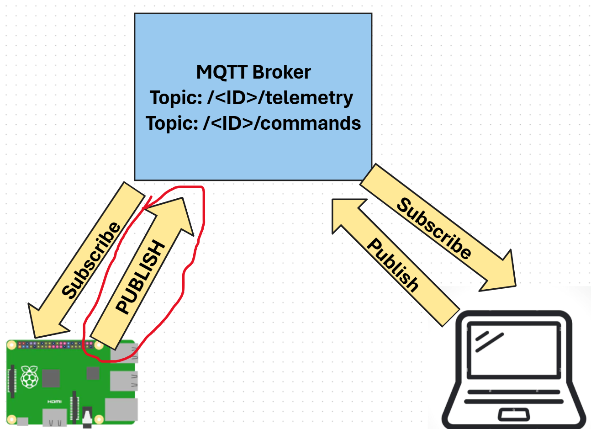

# Publish Temperature Telemetry

In this step, you will send telemetry with temperature from your  device to an MQTT broker.



## Publish telemetry

The next step is to create a JSON document with telemetry and send it to the MQTT broker.

### Task

Publish telemetry to the MQTT broker.

1. Open the sensor project in VS Code.

1. Add the following import to the top of the `app.py` file:

    ```python
    import json
    ```

    The `json` library is used to encode the telemetry as a JSON document.

1. Add the following after the `client_name` declaration:

    ```python
    client_telemetry_topic = id + '/telemetry'
    ```

    The `client_telemetry_topic` is the MQTT topic the device will publish temperature telemetry to.

1. Replace the contents of the `while True:` loop at the end of the file with the following:

    ```python
    while True:
        _, temp = sensor.read()
        telemetry = json.dumps({'temperature' : temp})

        print("Sending telemetry ", telemetry)
    
        mqtt_client.publish(client_telemetry_topic, telemetry)
    
        time.sleep(5)
    ```

    This code packages the temperature into a JSON document and publishes it to the MQTT broker. It then sleeps to reduce the frequency that messages are sent.

1. Run the code in the same way as you ran the code from the previous part of the assignment. If you are using a virtual IoT device, then make sure the CounterFit app is running and the temperature sensor and LED have been created on the correct pins.

    ```output
    (.venv) frank@rpifrank:~/temperature-sensor $ python3 app.py
    MQTT connected!
    Sending telemetry  {"temperature": 23}
    Sending telemetry  {"temperature": 23}
    ```

😀 You have successfully sent telemetry from your device.
