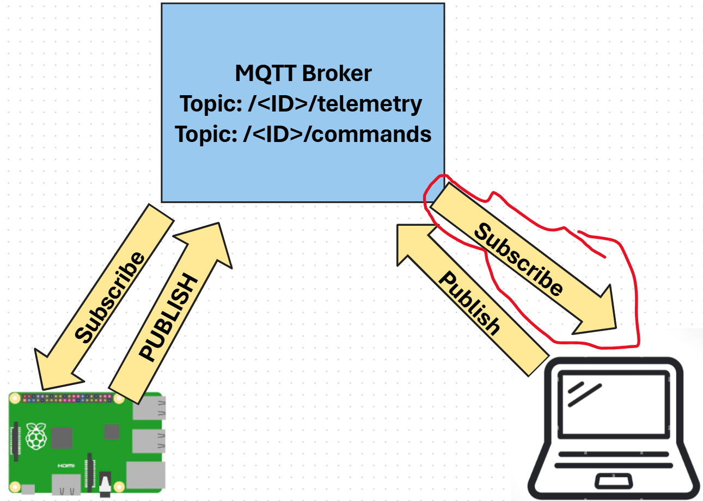

# Subscribe to Telemetry

There's no point in sending telemetry if there's nothing on the other end to listen for it. The temperature telemetry needs something listening to it to process the data. This 'subscriber' code is the kind of code you will deploy to a cloud service as part of a larger IoT application, **but here you are going to run this code locally on your computer.** The subscriber code consists of a Python app that listens to telemetry messages over MQTT with temoerature levels. Later in this lesson you will make it reply with a command message with instructions to turn the LED on or off.



1. On your computer/laptop, create a *temperature_sensor* folder.

   ```
   mkdir temperature-server
   cd temperature-server
   ```

   Or however you want to do it

1. Start the virtual environment as you did in a previous lab.
   ```
   python3 -m venv .venv
   ```

   

   Activate the Virtual Environment:
   Windows: 

   ```
   .\.venv\Scripts\Activate.ps1
   ```

   Mac

   ```
   source ./.venv/bin/activate
   ```

1. Install paho mqtt library

   ```
   pip install "paho-mqtt<2.0.0"
   ```

   

1. In t*emperature-server* folder, create a new file called `temp-server.py` file from the VS Code explorer and add the following code:

   ```python
   import json
   import time
   
   import paho.mqtt.client as mqtt
   
   id = '<ID>'
   
   client_telemetry_topic = id + '/telemetry'
   client_name = id + 'temperature_server'
   
   mqtt_client = mqtt.Client(client_name)
   mqtt_client.connect('test.mosquitto.org')
   
   mqtt_client.loop_start()
   
   def handle_telemetry(client, userdata, message):
       payload = json.loads(message.payload.decode())
       print("Message received:", payload)
   
   mqtt_client.subscribe(client_telemetry_topic)
   mqtt_client.on_message = handle_telemetry
   print("connected to broker")
   while True:
       time.sleep(2)
   ```

   Replace `<ID>` on line 6 with the unique ID you used when creating your device code.

   ⚠️ This **must** be the same ID that you used on your device, or the server code won't subscribe or publish to the right topic.

   This code creates an MQTT client with a unique name, and connects to the *test.mosquitto.org* broker. It then starts a processing loop that runs in on a background thread listening for messages on any subscribed topics.

   The client then subscribes to messages on the telemetry topic, and defines a function that is called when a message is received. When a telemetry message is received, the `handle_telemetry` function is called, printing the message received to the console.

   Finally an infinite loop keeps the application running. The MQTT client is listening to messages on a background thread and runs all the time the main application is running.

1. From the VS Code terminal, run the following to run your Python app:

   ```sh
   python temp-server.py
   ```

   The program will start listening to messages from the IoT device.

1. Make sure your device is running and sending telemetry messages. Adjust the temperature levels detected by your physical or virtual device. Messages being received will be printed to the terminal.

   ```output
   (.venv) PS C:\Users\fxwal\labs\temperature-server> python temp-server.py       
   connected to broker
   Message received: {'temperature': 20.0}
   Message received: {'temperature': 20.0}
   Message received: {'temperature': 21.0}
   
   ```
   
   The app.py file on your Raspberry Pi has to be running for this to work (i.e. it has to be publishing telemetry)

### Send commands to the MQTT broker

The next step for our Internet controlled device is for the server code to send a command back to the IoT device to control the LED based on the temperature levels it senses.

1. Open the temp_server.py code in VS Code if it's not open already

1. Add the following line after the declaration of the `client_telemetry_topic` to define which topic to send commands to:

   ```python
   server_command_topic = id + '/commands'
   ```

1. Add the following code to the end of the `handle_telemetry` function:

   ```python
   	temp = payload['temperature']
       command = { 'heating_on' : temp < 20 }
       print("Sending message:", command)
       client.publish(server_command_topic, json.dumps(command))
   ```

   This sends a JSON message to the command topic with the value of `heating_on` set to true or false depending on if the temperature is less than 20 or not. If the temperature is less than 20, true is sent to instruct the device to turn heating on (in this case an  LED on.

1. Run the code as before

1. Adjust the temperature levels detected by your physical or virtual device. Messages being received and commands being sent will be written to the terminal:

   ```output
   (.venv) ➜  nighttemperature-server python app.py
   Message received: {'temperature': 21.0}
   Sending message: {'heating_on': False}
   Message received: {'temperature': 19.0}
   Sending message: {'heating_on': True}
   ```

> 💁 The telemetry and commands are being sent on a single topic each. This means telemetry from multiple devices will appear on the same telemetry topic, and commands to multiple devices will appear on the same commands topic. If you wanted to send a command to a specific device, you could use multiple topics, named with a unique device id, such as `/commands/device1`, `/commands/device2`. That way a device can listen on messages just meant for that one device.


