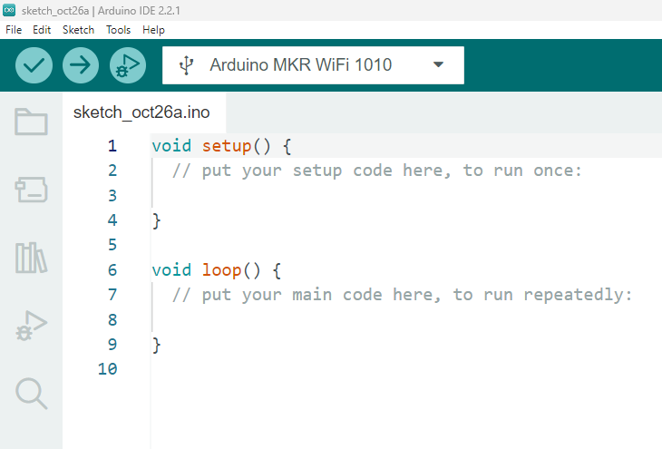

# Arduino IDE

The Arduino IDE (Integrated Development Environment) is a software platform that you can use to write, compile, and upload code to Arduino (and Arduino Compatible) microcontroller boards. 
In this section of the lab you will download and install Arduino IDE.

## Installing Arduino IDE

1. Go to the official Arduino website's download page: [Arduino Software (IDE)](https://www.arduino.cc/en/Main/Software) 
2. Choose the version that's appropriate for your operating system (Windows, macOS, or Linux).
3. Download the installer and run it. Follow the on-screen instructions to complete the installation. 
4. Once installed, run the IDE, you should see the following:
   