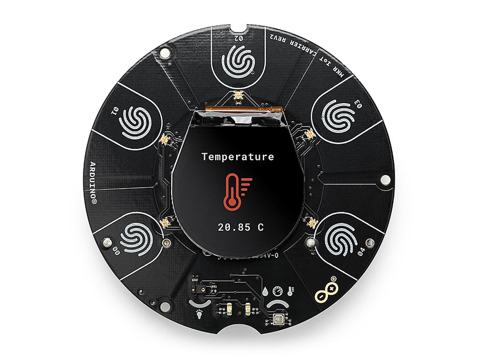
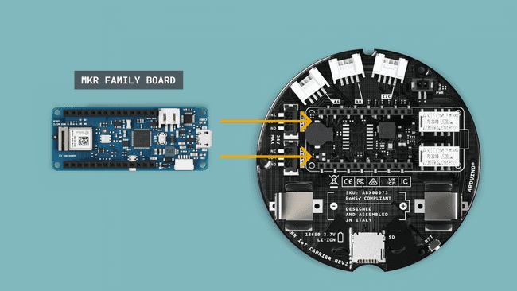

# MKR IoT Carrier Rev 2

Lets connect some of the stuff you have in your kit! Please be careful and always disconnect your Arduino board from power supply(i.e. pull out the USB cable) before connecting anything to it. 

The MKR IoT Carrier is a "Hardware Attached on Top" (HAT) device for the Arduino MKR boards. It combines sensors, LEDs,  relay circuits and a display in one device and allows the developer to  focus on prototyping and programming  projects.


### Mounting Board on the MKR IoT Carrier

The Arduino MKR 1010  board needs to be mounted on top of the MKR IoT Carrier Rev2. The board can be connected as shown in the image below, matching the pin numbers on the board to the ones on the carrier. Make sure you have it the right way around!

+ Line up the pins, matching the pin numbers on the board to the ones on the carrier, and push the board down into the Header socket.

  



+ Connect your Arduino to the computer. You should see the greed "PWR" LED light up on the Carrier board.

### Programming

To program the MKR IoT Carrier Rev2, the Arduino_MKRIoTCarrier library needs to be included. This library allows us to control and read all the components of the MKR IoT Carrier Rev2.

#### Add Library to Arduino IDE

+ In the Arduino IDE, go to the menu bar and click on Sketch > Include Library > Manage Libraries...

+ The Library Manager will open. In the search box (upper right), type `Arduino_MKRIoTCarrier`.

+ Once the Arduino_MKRIoTCarrier library appears in the search results, select it.

+ You'll see an Install button on the right side. Click on it. Agree to install all dependencies.

  

  

#### Flash the LEDs 

Setting up the Arduino_MKRIoTCarrier library requires an addition of few code lines in the initialisation and setup. The code used in the initialisation and setup is rarely changed, and it is required in every sketch. See the following example for flashing the LEDs on the Board:

+ Copy the following code into the Arduino IDE. 

````cpp
/*
  Blinks the LEDs on the MKR Carrier Rev2
*/
#include <Arduino_MKRIoTCarrier.h> 	//the Arduino_MKRIoTCarrier library needs to be included
MKRIoTCarrier carrier; 				//an object of type MKRIoTCarrier is created

void setup() {
  carrier.begin();					//initialises the Carrier board for use.
}
int red = 0, green = 0, blue = 255;  // RGB values of light
int ledColour = carrier.leds.Color(red, green, blue); //create colour to display on LEDs

void loop() {
  carrier.leds.fill(ledColour); 	//Set all LEDs to blue
  carrier.leds.show(); 				//update the new state of the LEDs 
  delay(1000);  					// Pause 1000 milliseconds (1 second)
  carrier.leds.fill(0); 			//Set all LEDs to no colour(off)
  carrier.leds.show(); 				//update the new state of the LEDs 
  delay(1000);						// Pause 1000 milliseconds (1 second)
}
````

Compile/Upload to the board as before. The LEDs should blink on and off every second (1Hz).
Again, review this code and understand the logic by reading the comments. Try the following by making changes to the code:

+ Change the colour to Red
+ Change the blink rate to 0.5 seconds


