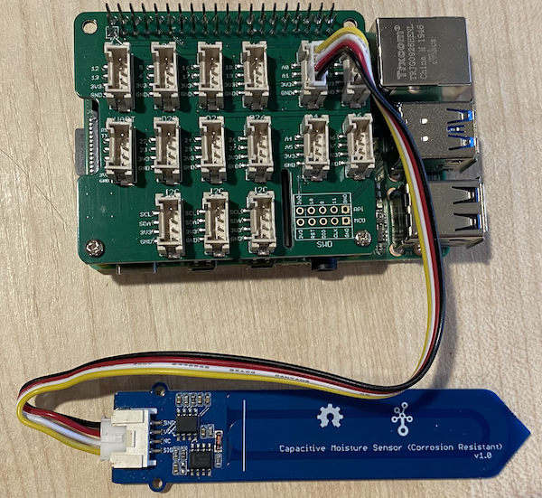
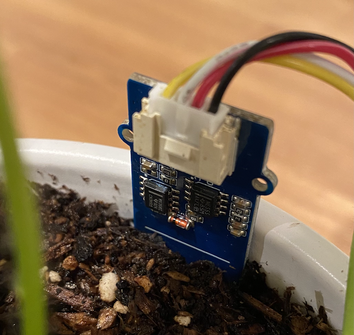

# Measure soil moisture - Raspberry Pi

Connect a soil moisture sensor to your Raspberry Pi, and read values from it.

https://clevergreen.ag/en/fotbal

## Hardware

The Raspberry Pi needs a soil moisture sensor.

The sensor you'll use is a [Soil Moisture Sensor](https://wiki.seeedstudio.com/Grove-Moisture_Sensor/), that measures soil moisture by detecting the capacitance of the soil, a property than changes as the soil moisture changes. As the soil moisture increases, the voltage decreases.

This is an analog sensor, so uses an analog pin, and the 10-bit ADC in the Grove Base Hat on the Pi to convert the voltage to a digital signal from 1-1,023. This is then sent over I<sup>2</sup>C via the GPIO pins on the Pi.

### Connect the soil moisture sensor

The Grove soil moisture sensor can be connected to the Raspberry Pi.

#### Task - connect the soil moisture sensor

1. Insert one end of a Grove cable into the socket on the soil moisture sensor. It will only go in one way round.

1. With the Raspberry Pi powered off, connect the other end of the Grove cable to the analog socket marked **A0** on the Grove Base hat attached to the Pi. This socket is the second from the right, on the row of sockets next to the GPIO pins.



1. Insert the soil moisture sensor into soil. Insert the sensor up to but not past the boundary between metal and blue line.



## Program the soil moisture sensor

The Raspberry Pi can now be programmed to use the attached soil moisture sensor.

### Task - program the soil moisture sensor

Program the device.

**Wifi Connection**

Before you power up the Raspberry pi, make sure it's configured to connect to the correct router in the lab. 

⚠️ You can refer to [the instructions previous labs if needed](https://tutors.dev/wall/lab/setu-iot-protocols-2026).

1. Power up the Pi and wait for it to boot

1. Launch VS Code, either directly on the Pi, or connect via the Remote SSH extension.

1. From the terminal, create a new folder in the home directory called `soil-moisture-sensor`. 

    ```bash
    mkdir soil-moisture-sensor
    cd soil*
    
    ```

1. Create a Python Virtual Environment in the `soil-moisture-sensor` folder: 

5. Once you have your virtual environment up and running , run the following **in the sensors folder** to install all the needed libraries for the Grove hardware:

```
git clone https://github.com/Seeed-Studio/grove.py
cd grove.py
pip install .

sudo raspi-config nonint do_i2c 0
```

6. Create a file in this folder called `app.py`.
7. Open this folder in VS Code
8. Add the following code to the `app.py` file to import some required libraries:

```python
import time
from grove.adc import ADC
```

The `import time` statement imports the `time` module that will be used later in this assignment.

The `from grove.adc import ADC` statement imports the `ADC` from the Grove Python libraries. This library has code to interact with the analog to digital converter on the Pi base hat and read voltages from analog sensors.

9. Add the following code below this to create an instance of the `ADC` class with the I2C address(0x08) of the Grove HAT:

```python
adc = ADC(0x08)
```

10. Add an infinite loop that reads from this ADC on the A0 pin, and write the result to the console. This loop can then sleep for 10 seconds between reads.

```python
while True:
    soil_moisture = adc.read(0)
    print("Soil moisture:", soil_moisture)

    time.sleep(10)
```

1. Run the Python app. You will see the soil moisture measurements written to the console. Add some water to the soil, or remove the sensor from the soil, and see the value change.

    ```output
    pi@raspberrypi:~/soil-moisture-sensor $ python3 app.py 
    Soil moisture: 615
    Soil moisture: 612
    Soil moisture: 498
    Soil moisture: 493
    Soil moisture: 490
    Soil Moisture: 388
    ```

    In the example output above, you can see the voltage drop as water is added.


😀 Your soil moisture sensor program was a success!
