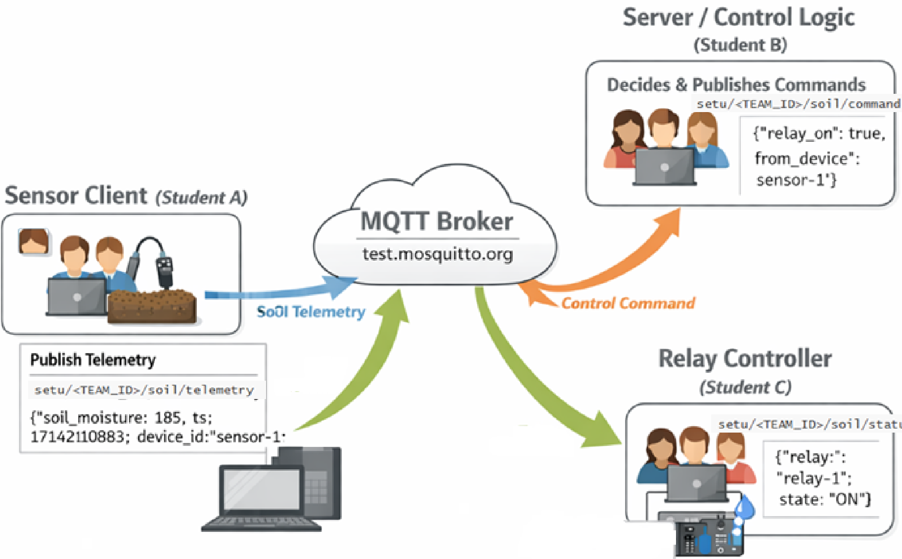

# Control over MQTT

## Overview
In this lab you decouple **sensing**, **decision-making**, and **actuation** using MQTT. Instead of a single script reading a sensor and driving a relay, the system is split into three cooperating components that communicate via a broker.

This mirrors real IoT systems used in areas such as **sports pitch management**, and **environmental monitoring**.

## Architecture (three roles)



All components communicate via an MQTT broker using a shared topic structure.

### Group structure

Students will work in **teams of three**:

- **One student** develops the **Sensor Client**
- **One student** develops the **Server (control logic)**
- **One student** develops the **Relay Controller**

Each team must choose a **unique `TEAM_ID`**, which is shared by all three components.

> If the `TEAM_ID` does not match across Sensor, Server, and Relay, the system will not function.

### Sensor Client
- Reads (or simulates) soil moisture
- Publishes **telemetry** messages

### Server (Control Logic)
- Subscribes to telemetry
- Applies decision logic (with hysteresis)
- Publishes **commands**

### Relay Controller
- Subscribes to commands
- Turns relay ON/OFF (or simulates)
- Optionally publishes **status**

> ⚠️ All three groups **must use the same TEAM_ID** or messages will not be received.

---

## MQTT configuration contract

### Broker
- Host: `test.mosquitto.org`
- Port:
  - `1883` – non-TLS

### Environment variable
```bash
export TEAM_ID=team7 
```

### Topics
```text
setu/<TEAM_ID>/soil/telemetry   # sensor → server
setu/<TEAM_ID>/soil/command     # server → relay
setu/<TEAM_ID>/soil/status      # relay → (optional monitoring)
```

---

## Message contract

### Telemetry message (JSON)
Published by *Sensor Client**.

```json
{
  "device_id": "sensor-1",
  "soil_moisture": 185,
  "ts": 1719052800.12,
  "telemetry_interval_seconds": 10
}
```

### Command message (JSON)
Published by **Server**.

```json
{
  "target": "relay-1",
  "relay_on": true,
  "reason": "dry",
  "soil_moisture": 185,
  "from_device": "sensor-1",
  "ts": 1719052810.55
}
```

### Status message (optional, JSON)
Published by **Relay Controller**.

```json
{
  "relay": "relay-1",
  "state": "ON",
  "ts": 1719052811.02
}
```

---

## Control logic (Server)

The server uses **hysteresis** to prevent relay chatter:

- Turn relay **ON** when `soil_moisture < DRY_ON_THRESHOLD`
- Turn relay **OFF** when `soil_moisture > WET_OFF_THRESHOLD`

Typical values:
- `DRY_ON_THRESHOLD = 200`
- `WET_OFF_THRESHOLD = 260`

The server **remembers the previous relay state**, so small fluctuations do not cause rapid toggling.

## Minimum integration test 

1. Sensor publishes a **fixed value** (e.g. `soil_moisture = 180`).
2. Server prints telemetry and publishes `relay_on = true`.
3. Relay client prints `Relay ON`.

If this works, the system wiring and topics are correct.

---

## Note on security

This lab focuses on **system architecture**.

- Telemetry and commands are plain JSON here
- **The next step** adds TLS and payload encryption

---

## Common problems

- No messages received → check `TEAM_ID`
- Connected but no output → check topic names
- Multiple clients disconnecting → ensure **unique MQTT client IDs** per role
