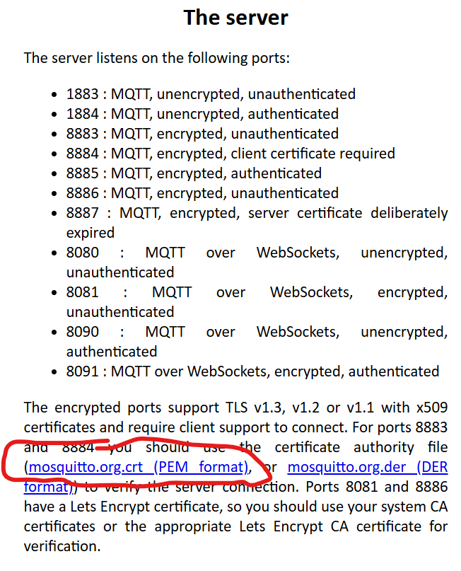

# MQTT Security Hardening

You are currently using a **public MQTT broker**, where anybody can publish/subscribe unless the broker enforces authentication and topic ACLs. This lab introduces two layers of protection:

1. **TLS (transport security)** — protects data *in transit* between client and broker.
2. **Payload encryption (application security)** — protects the message content even if the broker (or other subscribers) can see the topic traffic.

> ⚠️ Important: TLS does **not** stop someone subscribing to your topics on a public broker. For that you need **authentication + topic ACLs**, or a broker you control.


After your group has the system working (telemetry → server → command → relay), 

## TLS: secure connection to the broker

The broker instance we’re using supports TLS and supplies a certificate you can use to create a secure connection.

### 1) Download the broker certificate

- Go to https://test.mosquitto.org/ and download the TLS certificate file:



You can download it to your RPi using the following command:

```cmd
wget -O mosquitto.org.crt https://test.mosquitto.org/ssl/mosquitto.org.crt
```


### 2) Update your publisher to use TLS + QoS 1

- Open **client_pub.py** and add this just after `mqttc.createClient(..)`:

~~~python
mqtt_client.tls_set("./mosquitto.org.crt")
~~~

- To improve delivery reliability between client and broker, publish with QoS 1:

~~~python
 client.publish(
        TELEMETRY_TOPIC,
        payload=json.dumps(payload),
        qos=1,
        retain=False,
    )
~~~

> Note: QoS 1 can result in **duplicate** deliveries. Subscribers should be safe to process the same message more than once.

- Now run the publisher client as before, **but use the TLS port 8883** (update this in your code).

### 3) Update your subscriber to use TLS + QoS 1

- Open **client_sub.py**, add the certificate in the same way, and change the port to **8883**.

- Update the subscribe call:

~~~python
# Start subscribe, with QoS 1
mqttc.subscribe(TELEMETRY_TOPIC, qos=1)
~~~

Run the subscriber again. You should see it working as before, now using TLS and QoS 1.

---

## Payload encryption (Fernet)

Even with TLS, a public broker still allows other users to subscribe to your topics if they can guess them. Payload encryption protects the **message content** at the application layer.

We will use **Fernet** (symmetric encryption).

Install the crytography package:
```
pip install cryptography
```


### Key handling (do this instead of hard-coding)

Hard-coding keys is insecure. In this lab, store the key in an environment variable:

- Generate a key once (run in Python):

~~~python
from cryptography.fernet import Fernet
print(Fernet.generate_key().decode())
~~~

Add it as an environment variable in your terminal:

```bash
export FERNET_KEY="paste-your-generated-key-here"
```


## Update your sensor client(encrypt before publishing)

Add the following code under the last import:

~~~python
import os
from cryptography.fernet import Fernet

def _get_cipher():
    key = os.getenv("FERNET_KEY")
    if not key:
        raise RuntimeError("FERNET_KEY is not set")
    return Fernet(key.encode("utf-8"))

def encrypt_payload(payload_str: str) -> str:
    cipher = _get_cipher()
    token = cipher.encrypt(payload_str.encode("utf-8"))
    # publish as base64 text
    return token.decode("utf-8")
~~~

Replace the publish statements with something similar to this:

~~~python
client.publish(
        TELEMETRY_TOPIC,
        payload=encrypt_payload(json.dumps(payload)),
        qos=1,
        retain=False,
    )
~~~

Run **client_pub.py** as before.

---

## Update client_sub.py (decrypt on receipt)

Add the following code under the last import:

~~~python
import os
from cryptography.fernet import Fernet

def _get_cipher():
    key = os.getenv("FERNET_KEY")
    if not key:
        raise RuntimeError("FERNET_KEY is not set")
    return Fernet(key.encode("utf-8"))

def decrypt_payload(payload_bytes: bytes) -> str:
    cipher = _get_cipher()

    # messages arrive as bytes; we published base64 text
    token_str = payload_bytes.decode("utf-8")
    plaintext = cipher.decrypt(token_str.encode("utf-8"))
    return plaintext.decode("utf-8")
~~~

Update your `on_message(..)` handler to somethin:

~~~python
def on_message(client, obj, msg):
    try:
        print("Topic:" + msg.topic + ",Payload:" + decrypt_payload(msg.payload))
    except Exception as e:
        print("Topic:" + msg.topic + ",Payload:(could not decrypt)", e)
~~~

Run both programs again — you should now see the decrypted message in the subscriber console as before.

---

## Next step (recommended after the lab)

If you want “real” security (not just demos), move to a broker you control (local VM/RPi or cloud) and enable:
- username/password authentication
- per-topic ACLs (each team/device restricted to its own topic prefix)
- disable anonymous access
