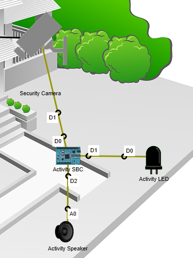

# Simulating IoT Devices (Sensing and Actuating) 

Using the techniques covered in the last exercises, you will now extend the solution to Exercise 6 to include a new, custom device.

### Specification
You have been tasked to simulate an *assisted living* device provides both a visual and audio indicator of activity at the front door of the Smart Home simulation in exercise 6. You are to use the custom component (Security Camera) to provide input to device to detect activity at the front door.

## Add and Connect Components 
+ In Packet Tracer, open the solution to **6. Modify/program Your Own Thing** 
+ Add the following components to the Logical View:  
  **Single Board Computer**(SBC); **LED** (to simulate visual indicator); **Speaker** (to simulate audio indicator)
+ Rename the devices as indicated in the following diagram. 
+ Connect them as shown in the following diagram. Use the "IoT Custom Cable" from the Connections and use the ports shown in the diagram.  

By reviewing the code in the Security Camera, we can see that the camera's digital port 1 is set to **HIGH** when it is activated by motion. This will act as our "motion sensor". When activity is sensed by the SBC, it will turn on the LED and play a audio recording on the speaker. 

+ Double-click the Activity SBC and select the Programming tab.
+ Select Blink (Python) project in the left pane and click the **Delete** button to remove it.   

+ Click on *New* and create a new Empty Python project called "Activity Detector".  

+ Double-click **ActivityDetector (Python)** project  in the left pane to open it.
+ Double-click **main.py** to open the Python script.
+ Enter the following code into the script pane (you can use copy and paste):  
~~~python
from gpio import *
from time import *

#Set up device at start up
def setUp():
	print("Setting Up Device...")
	pinMode(0, IN)
	pinMode(1, OUT)
	pinMode(2, OUT)
	digitalWrite(1, LOW)

#Event Handler for digital port 2
def handleSensorData():
	value = digitalRead(0)
	digitalWrite(1, value)
	digitalWrite(2, value)

#Main Scipt
def main():
	setUp() # set up device 
	add_event_detect(2, handleSensorData) # add event handler to port 2
	print("Device Ready...")
	while True:
		sleep(500)

if __name__ == "__main__":
	main()
~~~

+ Click the **Run** button to run the code. Return to the Logical Workspace , press **alt** key and pass mouse pointer over the Security Camera to simulate activity. The LED should come on and you should hear a audio notification.

+ Now examine the code. Notice how we can create an **Event Handler** and add it to a port. We will be using the same programming paradigm later in the module. 

## Reflection

This solution involves a direct connection from the SBC to the Security Camera. This may not be ideal in a real scenario, particularly as it means the Activity SBC needs a wired connection to the camera. Can you suggest another/better solution to connect the Activity SBC to the Camera?