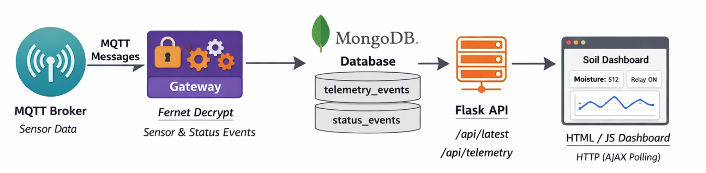

## Introduction

This lab introduces a simple but realistic IoT data pipeline that bridges **MQTT-based devices** with **web-based observability**. Sensor and relay devices publish encrypted telemetry and status messages to an MQTT broker, where a **Gateway** securely subscribes, decrypts, and persists the data into **MongoDB**. A lightweight **Flask HTTP API** then exposes selected views of this stored data, which are consumed by a plain **HTML/JavaScript dashboard** using periodic polling. The result is a clear separation of concerns devices publish events, the gateway handles security and persistence, and the web layer focuses on visualisation mirroring common patterns used in real-world IoT and edge-to-cloud systems.




## MongoDB

If you don't have one already,  you will need to install **MongoDB Community Edition** on your laptop and verify it using **MongoDB Compass**.

---

## Windows (MSI installer)

### 1) Download MongoDB Community Server (MSI)

Download the **MongoDB Community Server** installer for Windows (x64 MSI) from the official MongoDB site.

### 2) Install MongoDB

Run the MSI installer and follow the wizard.

Recommended choices:

- Install as a **Windows Service** (so it starts automatically)
- Use the default data directory unless your course requires otherwise

### 3) Confirm the MongoDB service is running

Open **PowerShell** and check services:

```powershell
Get-Service | findstr Mongo
```

If you see a service like `MongoDB`, you can start it with:

```powershell
Start-Service MongoDB
```

### 4) Verify MongoDB is running

**Option A: Compass (recommended)**

- Open MongoDB Compass

- Connect using:

  ```text
  mongodb://localhost:27017
  ```

## macOS (Homebrew)

### 1) Install Homebrew (if needed)

If Homebrew isn’t installed, follow the Homebrew instructions for macOS.

### 2) Install MongoDB Community Edition

In Terminal:

```bash
brew tap mongodb/brew
brew update
brew install mongodb-community
```

> If your course specifies a particular version, you can install a versioned formula (e.g. `mongodb-community@7.0`). See the official docs for your preferred version.

### 3) Start MongoDB

Start as a background service (recommended):

```bash
brew services start mongodb-community
```

Or run it in the foreground (for quick testing):

```bash
mongod --config /usr/local/etc/mongod.conf
```

### 4) Verify MongoDB is running

**Option A: Compass (recommended)**

- Open MongoDB Compass

- Connect using:

  ```text
  mongodb://localhost:27017
  ```

---

## Quick troubleshooting

### Compass can’t connect to `localhost:27017`

- MongoDB service isn’t running (Windows) or brew service not started (macOS)
- Port `27017` already in use
- Firewall or security software blocking local connections (rare)

### Database/collections not visible in Compass

- MongoDB creates databases/collections only after you insert data
- Click **Refresh** in Compass after your app writes data