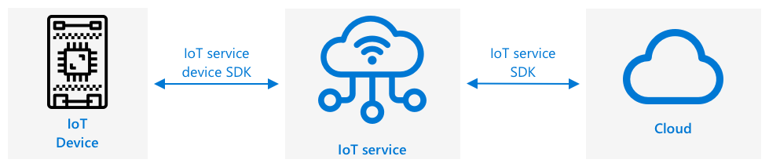
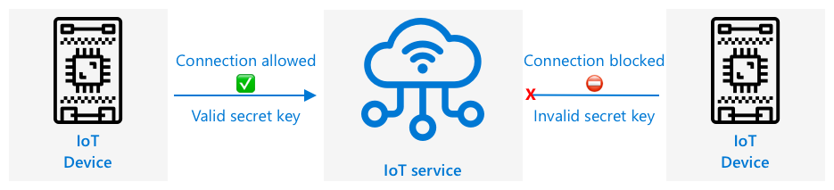

# Migrate your plant to the cloud

Azure Account Setup


> Sketchnote by [Nitya Narasimhan](https://github.com/nitya). Click the image for a larger version.


## Introduction

In the last lab, you learned how to connect your plant to an MQTT broker and controlled a relay from some server code running locally. This forms the core of the kind of internet-connected automated watering system that is used from individual plants at home up to commercial farms.

The IoT device communicated with a public MQTT broker as a way to demonstrate the principles, but this is not the most reliable or secure way. In this lesson you will learn about the cloud, and the IoT capabilities provided by public cloud services. You will also learn how to migrate your plant to one of these cloud services from the public MQTT broker.

### Microsoft Azure

Azure is the developer cloud from Microsoft, and this is the cloud you will be using for these lessons. The video below gives a short overview of Azure:

[https://www.microsoft.com/videoplayer/embed/RE4Ibng?WT.mc_id=academic-17441-jabenn](https://www.microsoft.com/videoplayer/embed/RE4Ibng?WT.mc_id=academic-17441-jabenn)

## Create a cloud subscription

To use services in the cloud, you will need to sign up for a subscription with a cloud provider. For this lesson, you will be signing up for a Microsoft Azure subscription. If you already have an Azure subscription you can skip this task. The subscription details described here are correct at the time of writing, but may change.

> 💁 If you are accessing these lessons through your school, you may already have an Azure subscription available to you. Check with your teacher.

There are two different types of free Azure subscription you can sign up for:

* **Azure for Students** - This is a subscription designed for students 18+. You don't need a credit card to sign up, and you use your school email address to validate that you are a student. When you sign up you get US$100 to spend on cloud resources, along with free services including a free version of an IoT service. This lasts 12 months, and you can renew every year that you remain a student.

* **Azure free subscription** - This is a subscription for anyone who is not a student. You will need a credit card to sign up to for the subscription, but your card will not be billed, this is just used to verify you are a real human, not a bot. You get $200 of credit to use in the first 30 days on any service, along with free tiers of Azure services. Once your credit has been used up, your card will not be charged unless you convert to a pay as you go subscription.

> 💁 Microsoft does offer an Azure for Students Starter subscription for students under 18, but at the time of writing this doesn't support any IoT services.

### Task - sign up for a free cloud subscription

If you are a student aged 18+, then you can sign up for an Azure for Students subscription. You will need to validate with a school email address. You can do this in one of two ways:

* Sign up for a GitHub student developer pack at [education.github.com/pack](https://education.github.com/pack). This gives you access to a range of tools and offers, including GitHub and Microsoft Azure. Once you sign up for the developer pack, you can then activate the Azure for Students offer.

* Sign up directly for an Azure for Students account at [azure.microsoft.com/free/students](https://azure.microsoft.com/free/students/?WT.mc_id=academic-17441-jabenn).

> ⚠️ If your school email address is not recognized, raise an [issue in this repo](https://github.com/Microsoft/IoT-For-Beginners/issues) and we'll see if it can be added to the Azure for Students allow list.

If you are not a student, or you don't have a valid school email address, then you can sign up for an Azure Free subscription.

* Sign up for an Azure Free Subscription at [azure.microsoft.com/free](https://azure.microsoft.com/free/?WT.mc_id=academic-17441-jabenn)

## Cloud IoT services

The public test MQTT broker you have been using is a great tool when learning, but has a number of drawbacks as a tool to use in a commercial setting:

* Reliability - it's a free service with no guarantees, and can be turned off at any time
* Security - it is public, so anyone could listen to your telemetry or send commands to control your hardware
* Performance - it is designed for only a few test messages, so wouldn't cope with a large amount of messages being sent
* Discovery - there is no way to know what devices are connected

IoT services in the cloud solve these problems. They are maintained by large cloud providers who invest heavily in reliability and are on hand to fix any issues that might arise. They have security baked-in to stop hackers reading your data or sending rogue commands. They are also high performance, being able to handle many millions of messages every day, taking advantage of the cloud to scale as needed.

> 💁 Although you pay for these upsides with a monthly fee, most cloud providers offer a free version of their IoT service with a limited amount of messages per day or devices that can connect. This free version is usually more than enough for a developer to learn about the service. In this lesson you will be using a free version.

IoT devices connect to a cloud service either using a device SDK (a library that provides code to work with the features of the service), or directly via a communication protocol such as MQTT or HTTP. The device SDK is usually the easiest route to take as it handles everything for you, such as knowing what topics to publish or subscribe to, and how to handle security.



Your device then communicates with other parts of your application over this service - similar to how you sent telemetry and received commands over MQTT. This is usually using a service SDK or a similar library. Messages come from your device to the service where other components of your application can then read them, and messages can then be sent back to your device.



These services implement security by knowing about all the devices that can connect and send data, either by having the devices pre-registered with the service, or by giving the devices secret keys or certificates they can use to register themselves with the service the first time they connect. Unknown devices are unable to connect, if they try the service rejects the connection and ignores messages sent by them.

✅ Do some research: What is the downside of having an open IoT service where any device or code can connect? Can you find specific examples of hackers taking advantage of this?

Other components of your application can connect to the IoT service and learn about all the devices that are connected or registered, and communicate with them directly in bulk or individually.

> 💁 IoT services also implement additional capabilities, and the cloud providers have additional services and applications that can be connected to the service. For example, if you want to store all the telemetry messages sent by all the devices in a database, it's usually only a few clicks in the cloud provider's configuration tool to connect the service to a database and stream the data in.

## Create an IoT service in the cloud

Now that you have an Azure subscription, you can sign up for an IoT service. The IoT service from Microsoft is called Azure IoT Hub.


The video below gives a short overview of Azure IoT Hub:

[](https://www.youtube.com/watch?v=smuZaZZXKsU)

> 🎥 Click the image above to watch a video

✅ Take a moment to do some research and read the overview of IoT hub in the [Microsoft IoT Hub documentation](https://docs.microsoft.com/azure/iot-hub/about-iot-hub?WT.mc_id=academic-17441-jabenn).

The cloud services available in Azure can be configured through a web-based portal, or via a command-line interface (CLI). For this task, you will use the CLI.

### Task - install the Azure CLI

To use the Azure CLI, first it must be installed on your PC or Mac.

1. Follow the instructions in the [Azure CLI documentation](https://docs.microsoft.com/cli/azure/install-azure-cli?WT.mc_id=academic-17441-jabenn) to install the CLI.

1. The Azure CLI supports a number of extensions that add capabilities to manage a wide range of Azure services. Install the IoT extension by running the following command from your command line or terminal:

   ```sh
   az extension add --name azure-iot
   ```

1. From your command line or terminal, run the following command to log in to your Azure subscription from the Azure CLI.

   ```sh
   az login
   ```

   A web page will be launched in your default browser. Log in using the account you used to sign up for your Azure subscription. Once you are logged in, you can close the browser tab.

1. If you have multiple Azure subscriptions, such as a school provided one, and your own Azure for Students subscription, you will need to select the one you want to use. Run the following command to list all the subscriptions you have access to:

   ```sh
   az account list --output table
   ```

   In the output, you will see the name of each subscription along with its `SubscriptionId`.

   ```output
   ➜  ~ az account list --output table
   Name                    CloudName    SubscriptionId                        State    IsDefault
   ----------------------  -----------  ------------------------------------  -------  -----------
   School-subscription     AzureCloud   cb30cde9-814a-42f0-a111-754cb788e4e1  Enabled  True
   Azure for Students      AzureCloud   fa51c31b-162c-4599-add6-781def2e1fbf  Enabled  False
   ```

   To select the subscription you want to use, use the following command:

   ```sh
   az account set --subscription <SubscriptionId>
   ```

   Replace `<SubscriptionId>` with the Id of the subscription you want to use. After running this command, re-run the command to list your accounts. You will see the `IsDefault` column will be marked as `True` for the subscription you have just set.

### Task - create a resource group

Azure services, such as IoT Hub instances, virtual machines, databases, or AI services, are referred to as **resources**. Every resource has to live inside a **Resource Group**, a logical grouping of one or more resources.

> 💁 Using resource groups means you can manage multiple services at once. For example, once you have finished all the lessons for this project you can delete the resource group, and all the resources in it will be deleted automatically.

1. There are multiple Azure data centers around the world, divided up into regions. When you create an Azure resource or resource group, you have to specify where you want it created. Run the following command to get the list of locations:

   ```sh
   az account list-locations --output table
   ```

   You will see a list of locations. This list will be long...

   

   Note down the value from the `Name` column of the region closest to you(for Ireland, North Europe is a good choice). You can find the regions on a map on the [Azure geographies page](https://azure.microsoft.com/global-infrastructure/geographies/?WT.mc_id=academic-17441-jabenn).

1. Run the following command to create a resource group called `soil-moisture-sensor` in North Europe. Resource group names have to be unique in your subscription.

   ```sh
    az group create --name soil-moisture-sensor --location northeurope
   ```

   

### Task - create an IoT Hub

You can now create an IoT Hub resource in your resource group.

1. Use the following command to create your IoT hub resource:

   ```sh
   az iot hub create --resource-group soil-moisture-sensor --sku F1 --partition-count 2 --name <hub_name>
   ```

   Replace `<hub_name>` with a name for your hub. This name needs to be globally unique - that is no other IoT Hub created by anyone can have the same name. This name is used in a URL that points to the hub, so needs to be unique. Use something like `soil-moisture-sensor-` and add a unique identifier on the end, like some random words or your name.

   The `--sku F1` option tells it to use a free tier. The free tier supports 8,000 messages a day along with most of the features of the full-price tiers.

   > 🎓 Different pricing levels of Azure services are referred to as tiers. Each tier has a different cost and provides different features or data volumes.

   > 💁 If you want to learn more about pricing, you can check out the [Azure IoT Hub pricing guide](https://azure.microsoft.com/pricing/details/iot-hub/?WT.mc_id=academic-17441-jabenn).

   The `--partition-count 2` option defines how many streams of data the IoT Hub supports, more partitions reduce data blocking when multiple things read and write from the IoT Hub. Partitions are outside the scope of these lessons, but this value needs to be set to create a free tier IoT Hub.

   > 💁 You can only have one free tier IoT Hub per subscription.

The IoT Hub will be created. It make take a minute or so for this to complete.

