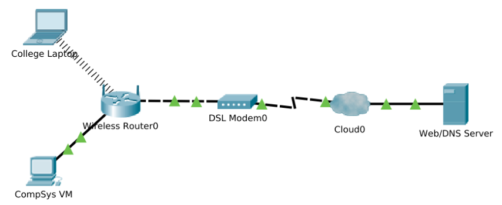

# Create a Simple Network Using Packet Tracer

Packet Tracer · Network Device Configuration · Network Simulation

In this lab you will create a simple network simulation in Packet Tracer. 
We will try to simulate a simple home network and save the simulation as a packet tracer file (.pkt).

## Objectives

+ Build a Simple Home Network in Packet Tracer using the Logical Topology Workspace
+ Configure Network Devices
+ Test Connectivity between Network Devices
+ Manage Packet Tracer files

## Prerequisites:

+ Cisco Packet Tracer
+ Internet Connection
+ Ideally, complete the previous lab!

## Topology

## Start Packet Tracer

Go to the following link and download the version for your Operating System. You may need to create an account with Cisco:

https://www.netacad.com/portal/resources/pt-resources

+ Start Packet Tracer on your machine and sign in.  
  
+ Once successfully signed in, you should a blank default Logical topology workspace. You're up and running!

