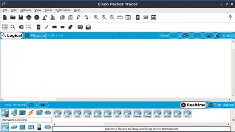
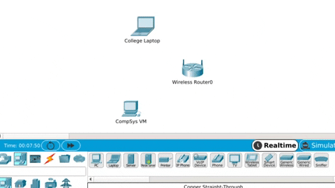

## Add Devices

Using the **device selection box**, add the network devices to the workspace as shown in the above topology diagram. To place a device onto the workspace: 

+ Choose a Device-Type from the *Device-Type* Selection box.
+ Then, click on the desired device model from the *Device-Specific* Selection box. 
+ Finally, click on a location in the workspace to put your device in that location. 
+ If you want to cancel your selection, click the
*Cancel* icon for that device. 
+ Alternatively, you can click and drag a device from the Device-Specific
Selection box onto the workspace as shown in the gif below:  

### Change display names.

+ Click on the PC0 device icon on the Packet Tracer Logical workspace, then click on the Config tab in the device configuration window. Type "CompSys VM" into the Display Name box as show in below.

+ Refer to the topology diagram on the previous page/step and change the name of the other devices where required. 

## Connect Devices

Using the device selection box, add the physical cabling between devices on the workspace as shown in the topology diagram.

+ Connect the **CompSys VM** to the **Wireless Router** using a **copper straight-through cable**. Select the copper straight-through cable in the device selection box and attach it to  the *FastEthernet0* interface of the CompSys VM and the *GigabitEthernet1* interface of the Wireless Router as illustrated in the below gif:

## Save your workspace
To save, click on *File* in the Packet Tracer menu bar and then select *Save* from the dropdown menu. In the the Save File window, choose the directory shown in the below image to save the file with the file name *home.pkt*. 
+ Click Save to save the file.  

