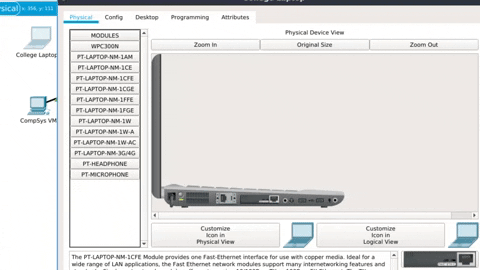

## Configure the Network Devices

Although we've physically connected devices with cables, they are not communicating yet. You will now configure the router, Laptop and CompSys VM and verify the connections are up.

## Configure the CompSys PC for the wired network
+ Click on the CompSys VM on the Packet Tracer Logical workspace and select the Desktop tab and then the IP Configuration icon.
+ In the IP Configuration window, select the DCHP radio button as shown in the figure so that the PC will use DCHP to receive an IPv4 address from the wireless router. Close the IP Configuration window.  

+ Close the IP Configuration window and click on the Command Prompt icon. Verify that the PC has received an IPv4 address by issuing the ``ipconfig /all`` command from the command prompt as shown in the figure. The PC should receive an IPv4 address in the 192.168.0.x range.  

### Configure the wireless router

Typically, you will have devices that connect using Wifi at home, such as a Laptop/phone. You will now configure a wireless network on the wireless router. This wireless router is tri-band and is probably similar to what you may have at home. 

+ Click on the Wireless Router icon on the Packet Tracer Logical workspace to open the device
configuration window.
+ In the wireless router configuration window, click on the *GUI tab* to view configuration options for the wireless router.
+  Click on the *Wireless* tab in the GUI to view the wireless settings. The only setting that needs to be changed from the defaults is the Network Name (SSID) for all 3 bands (2.4GHz and 5GHz). Here, type the name “HomeNetwork” as shown in the figure below:  

## Configure the laptop

Lets configure the Laptop to access the wireless network.  

+ Click on the Laptop icon on the Packet Tracer Logical workspace and in the laptop configuration windows select the *Physical* tab.
+ In the Physical tab you will need to remove the Ethernet copper module and replace it with the *Wireless WPC300N* module. To do this, you first power the Laptop off by clicking the power button on the side of the laptop. Then remove the currently installed Ethernet copper module by clicking on the module on the side of the laptop and dragging it to the MODULES pane on the left of the laptop window. 
+ Install the *Wireless WPC300N* module by clicking on it in the MODULES pane and dragging it to the empty module port on the side of the laptop. Power the laptop back on by clicking on the Laptop power button again.  

With the wireless module installed, the next task is to connect the laptop to the wireless network.

+ Click on the *Desktop* tab at the top of the Laptop configuration window and select the *PC Wireless* icon.
Once the Wireless-N Notebook Adapter settings are visible, select the *Connect* tab. The wireless network “HomeNetwork” should be visible in the list of wireless networks as shown in the figure.
Select the strongest signal and click on the Connect button.  

You should now see the connection indicted in the logical workspace.

So this (sort of!) represents what you have going on with your Laptop at homefrom a "logical" perspective. 

+ **Save now using File->Save from the menu.**