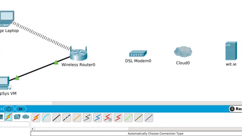
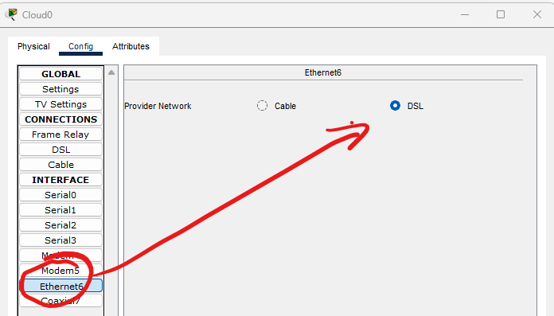

# Configure the Internet cloud

So at the moment you have a local area network(LAN). In this section you will add components to simulate connecting to a wide area network and the internet, similar to how homes connect to the internet using DSL modems.

## Add and Connect Devices

+ In Packet Tracer, place a *PT-Cloud*  and *DSL Modem* on the Logical Workspace (you can get them from Network Devices -> WAN Emulation)
+ Also, place a *Server* on to the workspace (from End Devices)
+ Connect the Wireless Router, DSL Modem, Cloud and Server using the automatic connection option as shown below:  

NOTE: WHEN YOU ADD THE SERVER, THE NAME DISPLAYED WILL BE "SERVER1" , UNLIKE THE ABOVE GIF. 

+ Click on the **Internet Cloud** icon on the Packet Tracer Logical workspace and click on the **Config** tab in the Cloud device window. In the left pane click on DSL under CONNECTIONS. In the first drop down box choose *Modem* and in the second drop down box choose
  *Ethernet* **then click the *Add* button to add these as the From Port and To Port as shown in the figure.**  
  

+ While still in the Config tab click Ethernet under INTERFACE in the left pane. In the Ethernet configuration window select *DSL* as the Provider Network as shown in the figure.

  

## Configure the  server

+ Click the Server on the Packet Tracer Logical workspace and select the *Services* tab.
+ Select *DHCP* from the Services list in the left pane.
+ In the DHCP configuration window, configure a DHCP as shown in the figure with the following settings.  

+ Click Add to add the pool. **Make sure to turn the DHCP service on.**

## DNS Service

+ While still in the Services tab in the Server, select *DNS* from the SERVICES listed in the left pane.

+ Configure the DNS service using the following settings as shown in the figure.  

+ Click Add to add the DNS service settings

## Configure the Web server Global settings.

+ Select the Config tab and Click on Settings in left pane.
+ Configure the Global settings for just IPv4 as follows:  

## Configure the server FastEthernet0 Interface settings

+  Click on FastEthernet in left pane of the Config tab and enter the FastEthernet Interface settings of the server as follows:

## Verify Connectivity

Verify that the PC is receiving IPv4 configuration information from DHCP.

+ Click on the Laptop on the Packet Tracer Logical workspace and in the *Desktop* tab, select the *Command Prompt* icon.
+ In the command prompt, refresh the IP settings by issuing the commands ``ipconfig /release`` and then ``ipconfig /renew``. The output should show that the PC has an IP address in the 192.168.0.x range, a subnet mask, a default gateway, and DNS server address as shown below.
+ In the same command prompt, enter the command ``ping wit.ie``. It may take a few seconds for the ping to return.  

+ **Save your Packet Tracer file.**
