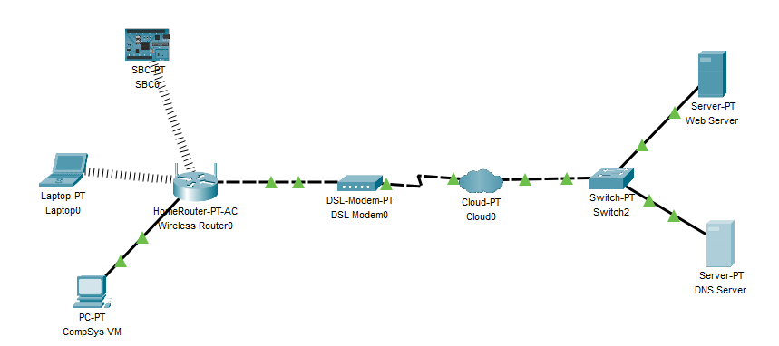

# Exercises

## Add a single board computer(Raspberry Pi)
+ Select *Components->SBC Board* from the Devices and place it on the Logical Workspace.
+ Connect to the Wireless Router using Wifi interface. 

## Wireless Security
So at the moment, any device can connect to the Wireless Router. 
+ Configure **WPA2 Personal** security with **AES** encryption on all bands of the Wireless router(2.4, 5-1, 5-2 GHz). Use the same passphrase of your choice for all bands.
+ Update the wireless devices (Laptop and Raspberry Pi) Wifi configuration to authenticate using WPA2-Personal/WPA2-PSK. Test it works by pinging *wit.ie*. 

# OPTIONAL

Typically, a DNS server would be on a different machine to the domain names/IP addresses it serves. To emulate this, add a *PT Switch* and another *Server* as shown in the diagram below. 

+ Rename your existing Web/DNS Server to **DNS Server**.

+ Name the new server **Web Server**.

  

Connect them and configure the **Web Server** as follows:

+ Set the Global Settings Gateway: 84.203.132.1, DNS Server: 84.203.132.220
+ Set the FastEthernet0 IP address to 84.203.132.221, subnet mask 255.255.255.0

### Add DNS entry for Web Server
+ **In the DNS Service on the DNS Server**, add a new "A Record" for the domain **mywebdomain.ie** and associate it with the IP address of the new web server (84.203.132.221).  

Finally, ping *mywebdomain.ie* from an end device in the Home LAN. All going well, you should see a response as follows:

It may take a little while to respond. The first ping may timeout also. Try to figure out why this might happen (next lecture will shed some light on this). 

## Save!

Save your file