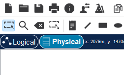
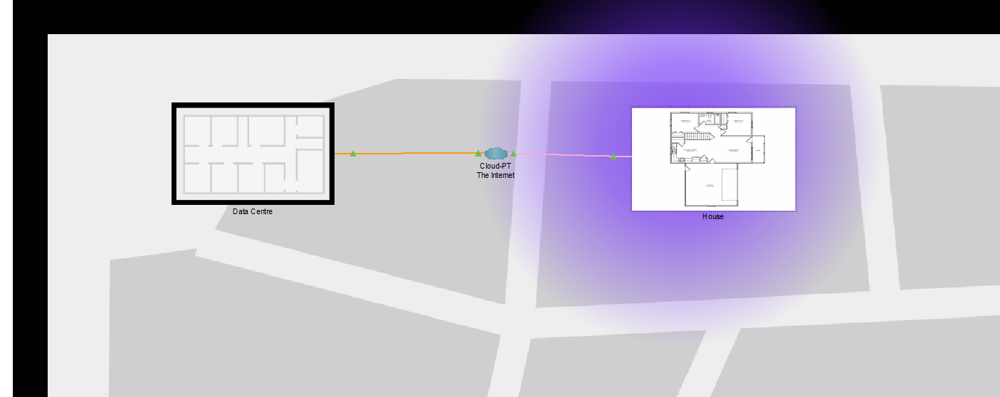
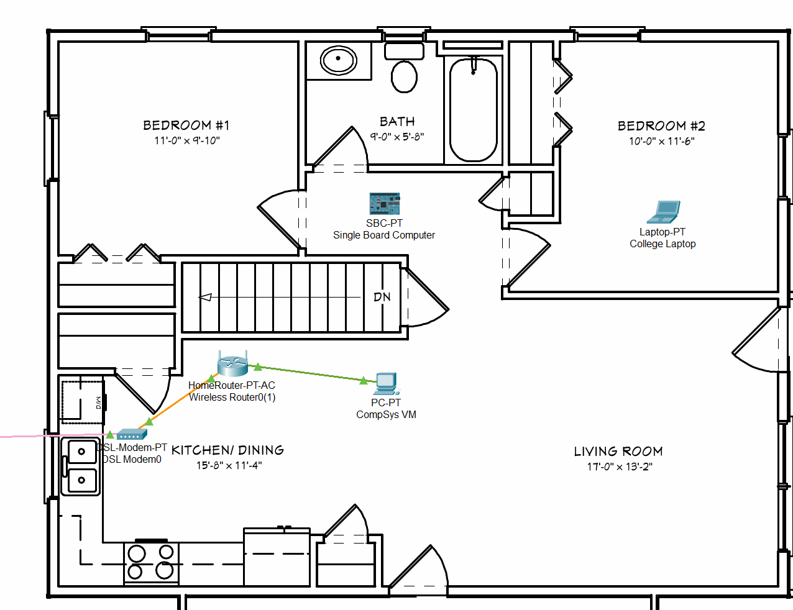
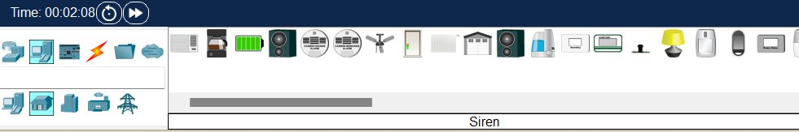
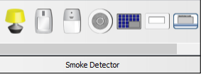
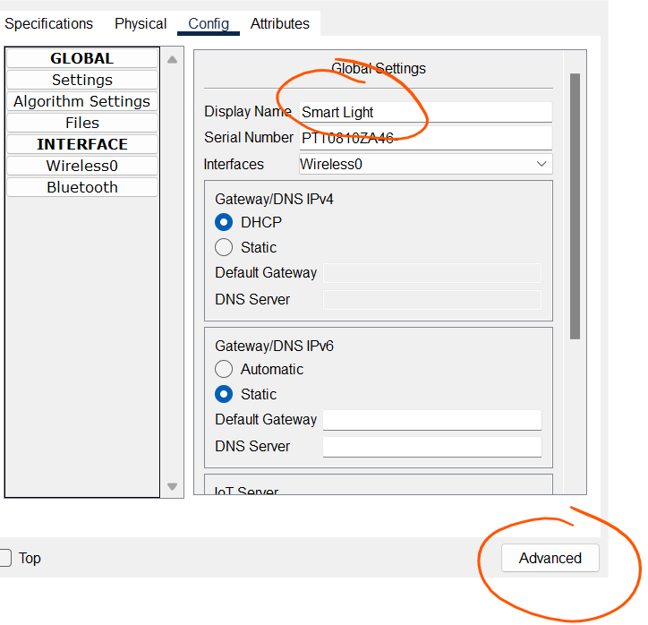
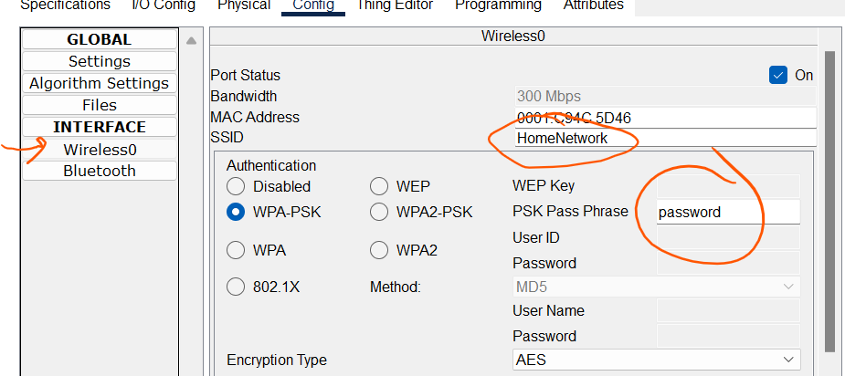
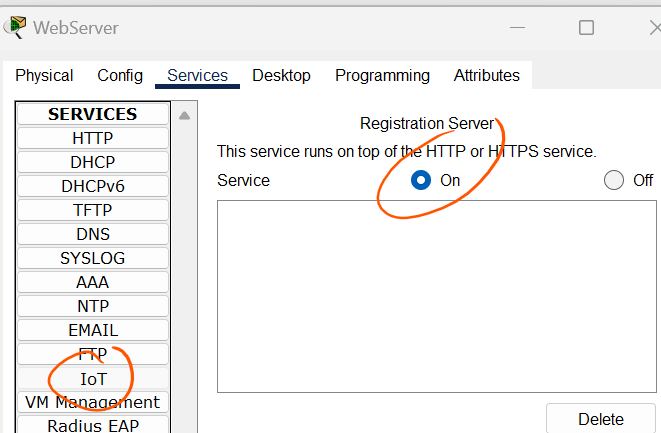
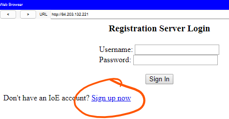
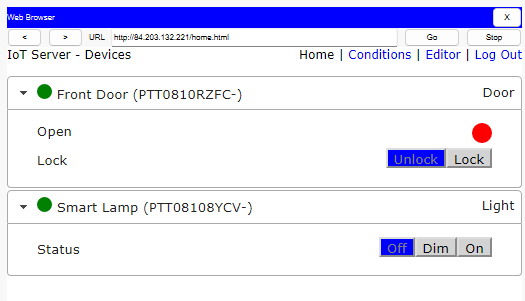

# Simulating IoT Devices in Packet Tracer

Get the Packet Tracer Starter File here and  save the to your computer.
[Packet Tracer Starter File](./archives/starter.pkt)

### Logical and Physical View

When Packet Tracer opens, the default view is the **Logical view**. Take a look at the network topology. This is the solution to week4,lab 2.

+ Click the **Physical** view button to change to the Physical view. 

+ Click on **Home City**. This will contain 2 locations, **House** and **Data Centre** connected via the Internet Cloud.

+ Double click on the **House**. Use the Zoom controls to size the view to suit you. You should see the wireless router and connected devices:

### IoT End Devices.

+ In the bottom left corner of the Packet Tracer window, locate and click the **[End Devices]** icon in the top row, and the **[Home]** icon in the bottom row of the Device-Type Selection box.

The Device-Specific Selection box displays the many different Smart Home IoT devices available. Move the mouse pointer over each device and notice that the descriptive name of the device is displayed at the bottom of the Device-Specific Selection box. Take a moment to look at each device type.

### Add IoT Device to Network

Keep the Physical view of the House open. 

+ Select **[End Devices]** icon and then **[Home]**. Then select the **Light** and add it to Bedroom #1 in the  physical View

+ Hover over the Light with the mouse and use Alt + Click to change the light state from off->on->dim

+ Double click on the light to configure it. 

+ In the Config tab, change the name to Smart Light. 

  

+ Select the **Wireless0** interface and connect to the **HomeNetwork** wifi using the password "**password**"

### Remote IoT Server

Smart devices are typically manageable through phone apps or web applications operating within a browser. Prime examples include systems like **Google Home** and **Ring**.

Such applications use a remote server that acts as an intermediary between the user's control devices (like smartphones or computers) and the Internet of Things (IoT) devices. This setup enables users to control IoT devices remotely, such as turning off an immersion heater from any location worldwide. To demonstrate this concept, we can replicate a comparable architecture by establishing a Remote IoT Server in our Packet Tracer simulation.

+ In Packet Tracer, select the  **Logical View** and click **WebServe**r in the workspace to open the configuration window. Click the **Services tab** and then click the **IoT service** in the left pane. Click the **“On”** button to enable the service.

  

### Register on the Remote IoT Server

+ Click the **College Laptop**  and click **Web Browser** icon in the **Desktop** tab. Enter the **IPv4 address of the WebServer** in the URL box and then click Go. Because there is no IoT account created yet, one will need to be created. Click the Sign up now option.

+ Enter a username and password (**remember it! - you'll need it in the next step**) and then click Create to create the IoT account. 

Notice in the IoT Server – Devices window there are no IoT devices listed. You will now need to register your devices with the server.

##### Register IoT devices to the Registration Server

+ Click the **Smart Light** icon in the workspace to open the device configuration window.
+ Click the **Config tab**. Select **Global->Settings** and, for the IoT Server, select Remote Server. Enter the **IP address of the Remote IoT Server(84.203** from  use the IoT account Username and Password created in the last step. Next, click the Connect button.

+ Repeat this process to **add a connected Front Door** a follows: 
  Return to Physical view, Go to House and add a Door
  Connect to Wifi
  Register Door to Registration Server

### Control the IoT Device

+ Access the IoT Server through the **College Laptop browser** using credentials from previous steps. The  the Smart Light, and the Door should now be registered with the IoT Server. 

+ Change the status of the Door and Smart lamp using the web app. 

**SAVE YOUR PACKET TRACER FILE NOW**

