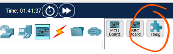
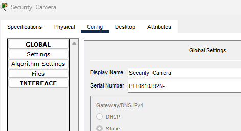
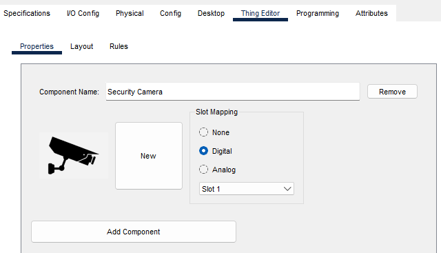
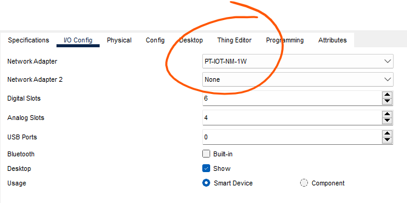
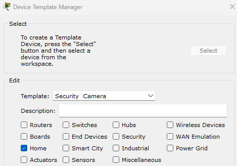
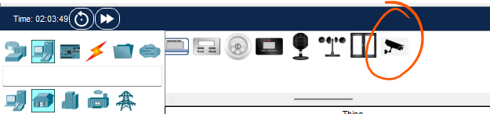

# Create a Custom Thing

In this step, you will create your own custom IoT "Thing". In this exercise, we will create a Security Camera which will be used to detect people at the front door of the house.

+ In Packet Tracer, select the Physical view and navigate to the House

+ Select Components and select the **Thing** component from the device selection box and **add** it to the workspace.

+ Click on the **Thing** in the Packet Tracer workspace to open the device configuration window. 
+ Click on the **Config tab** and then click on the **Global Settings** in the left side pane. Change the **Display Name** of the device to **Security Camera**.

+ Click on **Advanced button** in the bottom right of the device configuration window, then click on **Thing Editor Tab**, and then the Properties tab.
+ Change **Component Name** to Security Camera. Change Slot Mapping to **Digital** and **Slot Number to 1**. 

+ To add icon graphic, click the New button. The Choose Image window will open allowing you to browse for a new icon. You can download a picture or graphic of a security camera by right clicking on the below image and downloading:

 or get your own from the internet (you might have to resize it though)

#### Add the security camera to the network.

You need to add a network adapter to the security camera so that it can connect to a network. 

+ Click on the **Advanced** button and then click on the **I/O Config tab.** In the I/O Config window change the **Network Adapter dropdown menu** to the **PT-IOT-NM-1W** adapter. This is a wireless(Wifi) adapter . Attach the security camera to the network.

**Save your Packet Tracer File** before the next step.

### Save the New Device 

To make your device available in other Packet Tracer files, you can save the security camera using the Device Template Manager. 

+ Click on **Tools** in the **Packet Tracer** menu and select **Custom Devices Dialog** in drop menu. 
+ In the **Device Template Manager** window click on the **Select** button. The Device Template Manager window will disappear and then click on the Security Camera in the workspace which will bring the Device Template Manager window. Make sure the **Template name** is set to **Security Camera.**

+ Choose a Packet Tracer template area by checking the Home checkbox. 
+ Click Add in the bottom right of the Device Template Manager window. 
+ The Save File in Template Folder window opens. Keep the default file name of Security Camera and click Save. 
+ Save your file and close Packet Tracer file. Open a new Packet Tracer file . Confirm that security camera should now be in the list of Home devices in the Device Selection Box.

