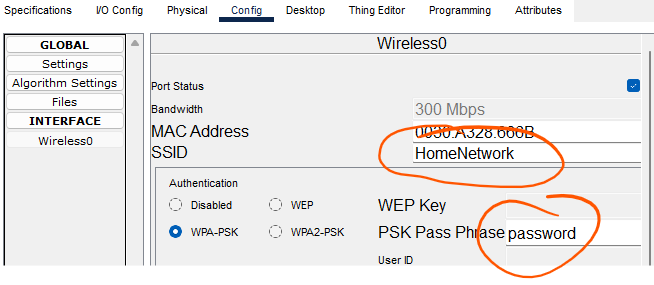
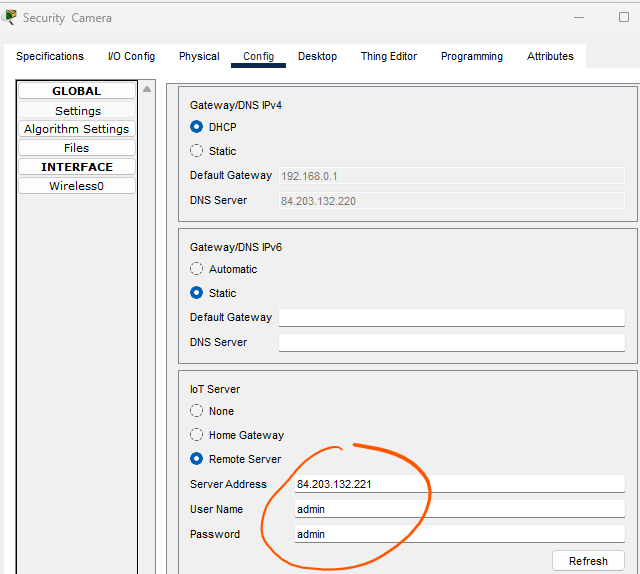
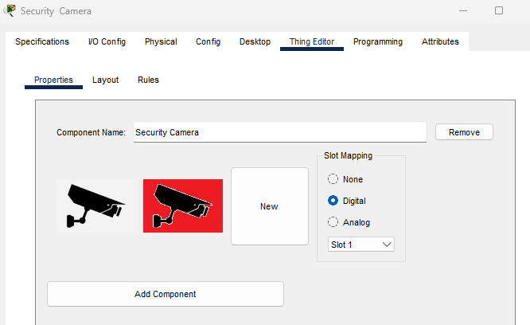
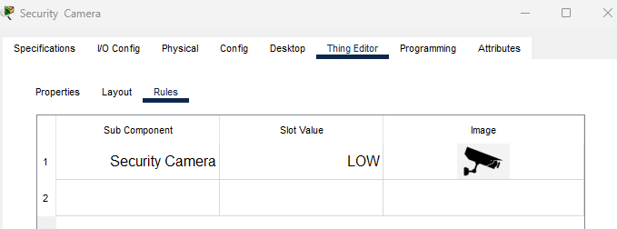
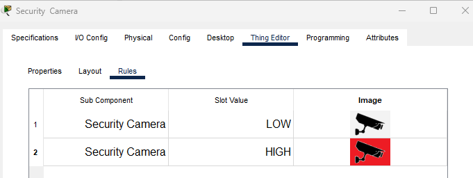
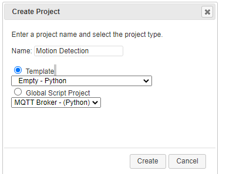
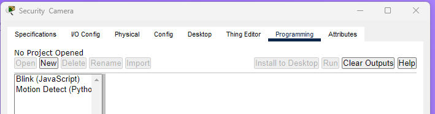
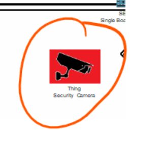

# Configure/Program the Device

You will now modify/program the security camera IoT device created in the previous step. This will give it the required behaviour expected from the camera when it's activated. 

### Modify Security Camera

Select the Security Camera on the Packet Tracer workspace to open the device configuration window.

In the config tab, Select the wireless interface and connect the Security camera to the Wifi network

Still in the config tab for Wireless0, set "IP Configuration" to DHCP. This will allow your Think to acquire an IP address. 

Still in the Config tab, select Settings and connect the Security Camera to the remote IoT Server:

Click on Advanced button in the bottom right of the device configuration window, then click on Thing Editor Tab, and then the Properties tab

Click on the New button. The Choose Image window will open allowing you to browse for a new icon. Select a different image for the security camera for when it is activated. You can use this one if you wish(right click and do a "save image as...":

Your Security Camera configuration should look like this when complete

#### Add Rules

Next, click on the Rules tab. Click the Add Button.

Click in the Sub Component column and select Security Camera in the drop down menu. The Slot Value should change to LOW and the Image should show the security camera image that will be used as the icon when the camera is deactivated.

Click the Add Button again. Click in the Sub Component column and select Security Camera in the drop down menu. Click in the Slot Value column and select HIGH and click in the Image column and select the second security camera image that will be used as the activated icon

## Program the Security Camera

Click on the Programming tab. You'll notice there is no code yet for the device. 

Click the New project button above the left pane. In the ***Create Project*** window, create a new empty Python programming project named **Motion Detect** and click Create. **Remember to select Empty-Python for the template**

To view the new project just created click on the .. in the left pane and click Open.

There is now a Security Camera (Javascript) project in the left pane. Click on Security Camera project and click Open.

Select main.js in the left pane and paste in the following code in the edit window:

~~~python
from gpio import *
from time import *
from ioeclient import *
from physical import *
from bluetooth import *
import math

DEACTIVATE_TIMER = 5; # in seconds
state = 0
current_time = 0

#Entry point for device.
def main():
	setup()
	while True:
		loop()

#intiialises device. Registers with IoT server using IoEClient.Ses state to 0(nothing detected/camera off).
def setup():
    IoEClient.setup({
        "type": "Security Camera",
        "states": [{
            "name": "On",
            "type": "bool",
            "controllable": False
        }]
    })
    global state
    state = 0
    setState(state)

def mouseEvent(pressed, x, y, firstPress):
    setState(1)

def loop():
    global state
    global current_time
    if  state == 1 :
        current_time = current_time - 1
        if  current_time <= 0 :
            setState(0)

    sleep(1)

def setState(newState):
    global state
    global DEACTIVATE_TIMER
    global current_time
    state = newState

    if  state is 0 :
        digitalWrite(1, LOW)
    else:
        digitalWrite(1, HIGH)
        current_time = DEACTIVATE_TIMER

    IoEClient.reportStates(state)
    setDeviceProperty(getName(), "state", state)
    
if __name__ == "__main__":
    main()
~~~

 	 	

Run the program by clicking on the **Run** button.

### Test It

Click on the Security Camera by doing a alt+click. You should see the camera activate by switching to the Acticvated image. 

**Save your Packet Tracer File.**