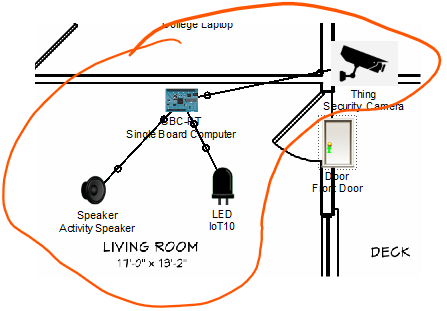
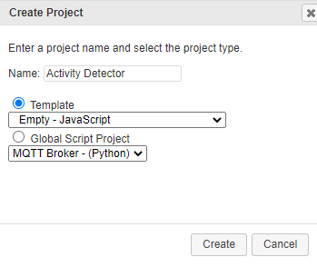

# Simulating IoT Devices (Sensing and Actuating) 

Using the techniques covered in the last steps, you will now combine devices in the simulation to test a IoT solution

### Specification
You have been tasked to simulate an *assisted living* device provides both a visual and audio indicator of activity at the front door of the Smart Home simulation. You are to use the custom component (Security Camera) to provide input to device to detect activity at the front door.

## Add and Connect Components 
+ In Packet Tracer, open the House and select the Physical View
+ Add the following components to the Physical View:  
  **LED** (to simulate visual indicator); **Speaker** (to simulate audio indicator)
+ Rename the devices as indicated in the following diagram. 
+ Connect them as shown in the following diagram. Use the "IoT Custom Cable" from the Connections and use the ports shown in the diagram. Connect the devices as follows using the IoT Custom connection:
  + Security Camera D1 to SBC D1
  + LED D0 to SBC D2
  + Speaker D0 to SBC D3
+ 

By reviewing the code in the Security Camera, we can see that the camera's digital port 1 is set to **HIGH** when it is activated by motion. This will act as our "motion sensor". When activity is sensed by the SBC, it will turn on the LED and play a audio recording on the speaker. 

+ Double-click the **Single Board Computer (SBC)** and select the **Programming** tab.
+ Select Blink (Python) project in the left pane and click the **Delete** button to remove it.   

+ Click on ***New*** and create a new **Empty-Python** project called "**ActivityDetector**".  

+ Double-click **ActivityDetector (Javascript)** project  in the left pane to open it.
+ Double-click **main.js** to open the Python script.
+ Enter the following code into the script pane (you can use copy and paste):  
~~~javascript
function setup() {
	pinMode(1, INPUT);
	pinMode(2, OUTPUT);
	pinMode(3, OUTPUT);
	digitalWrite(1, LOW);
	
}

function loop() {
	var value = digitalRead(1)
	digitalWrite(2, value)
	digitalWrite(3, value)
}

~~~

+ Click the **Run** button to run the code. Return to the Logical Workspace , press **alt** key and pass mouse pointer over the Security Camera to simulate activity. The LED should come on and you should hear a audio notification.. 


## Register with IoT Server

+ Add the following statement to the setUp() function on the Security Camera:
  ```javascript
  	IoEClient.setup({
  		type: "Wind Detector",
  		states: [{
  			name: "Security Camera",
  			type: "bool",
  			controllable: false
  		}]
  	});
  ```

  + Restart the program. 

As before, connect to the Remote IoT Server using the Web Browser in on the Laptop. Use the IP of the IoT server 84.203.132.221 and click Go. 

Sign in using the credentials you used in the last step.

In the Server-Devices Window, click on the Security Camera to expand the device information. Notice the Security Camera is On but not activated.


#### Activate the Security Camera.

Move the Laptop configuration window out of the way but still visible so that the Packet Tracer workspace is visible. Hold down the Alt key on the keyboard and move the mouse cursor over the Security Camera icon(This simulates someone stepping into the range of the camera) . Notice the icon will change to the image used as the activated icon and the Security Camera status changes to activated indicated by the green dot in the Server-Devices list on the IoT Server.

