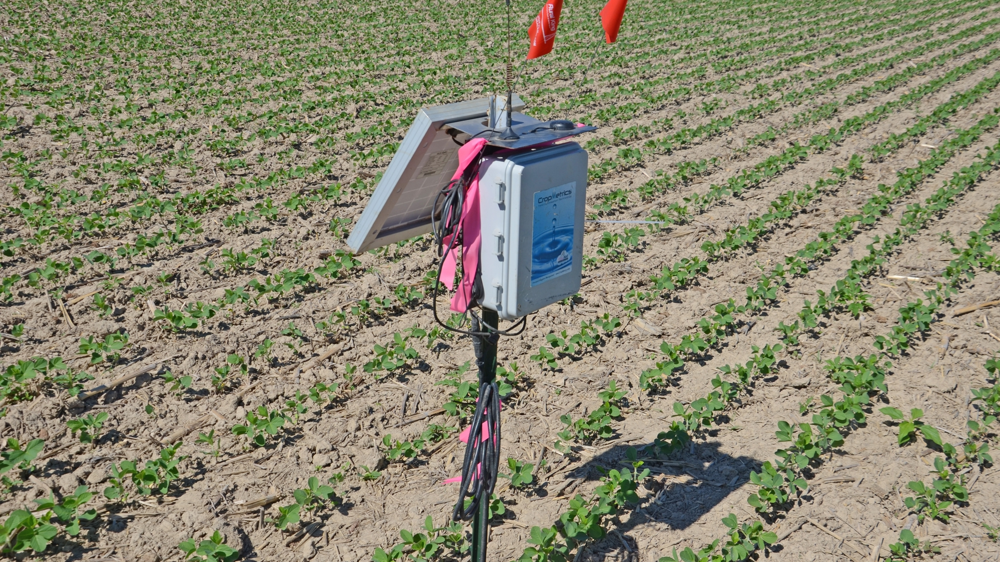

# Soil Moisture in Agriculture (and Sensors)

+ Last class we talked about ambient temperature

  + used it to switch on/off LED

+ Hard to control temperature (control environment using heaters etc)

+ Moisture is another ambient property we can control

  + Easier to control(either with watering can or large scale irrigation system)

+ Agenda

  + Soil Moisture

  + How do sensors communicate with IoT devices?

    + Serial communications

    

---

## Digital Agriculture

*   Digital agriculture uses tools to collect, store, and analyse farming data  .
*   It is also known as the 'Fourth Agricultural Revolution' or 'Agriculture 4.0'  .
*   It encompasses the entire 'agriculture value chain', from farm to table . This includes tracking produce quality, warehouse systems, and even tractor rental apps .
*   Digital agriculture allows farmers to increase yields, use less fertilizers and pesticides, and optimise water use .
*   'Precision Agriculture' is a technique that observes, measures, and responds to crops on a per-field basis .

---

## Techniques Enabled by Digital Agriculture

*   **Temperature measurement** - to predict plant growth and maturity .
*   **Automated watering** - using soil moisture sensors to water only when needed .
*   **Pest control** - using cameras on robots or drones to apply pesticides only where needed .

---

## Soil Moisture

- Water Uptake:

  - Plants absorb water through their roots, which is essential for growth.

- Key Functions:

  - Photosynthesis:

    - Combines water, carbon dioxide, and light to produce carbohydrates and oxygen.

  - Transpiration:

    - Water loss through leaf pores helps draw in CO₂, transports nutrients, and cools the plant.
    - *Research Note:* Approximately 90–98% of water absorbed can be lost through transpiration.

  - Structural Support:

    - With plants being about 90% water, moisture maintains cell rigidity and overall structure.

      

---

## Why monitor Soil Moisture

- Optimal Conditions:
  - Ideal soil moisture levels are crucial; too little water restricts nutrient absorption, while too much leads to root oxygen deficiency and decay.
- Impact on Plant Health:
  - Balanced moisture ensures healthy root function and supports overall plant vitality.
- Modern Solutions:
  - IoT devices help farmers monitor soil moisture in real time, ensuring watering only when necessary.

---

## Soil Moisture Sensors

**Resistive Sensors:**

- Use two metal probes to measure electrical resistance in the soil.

- Higher water content lowers resistance, providing an indicator of moisture levels.

- Can be built simply (e.g., using two nails and a multimeter).

  

**Capacitive Sensors:**

- Measure changes in capacitance between electrical plates due to varying soil moisture.

- Convert these changes into a measurable voltage for IoT devices.

  

**Common Output:**

- Both sensor types produce an **analog** voltage that reflects soil moisture levels for further digital processing.

---

## Sensor Communication to Device

+ How does a resistance measurement from a soil moisture sensor become a number you can use from code?
+ 