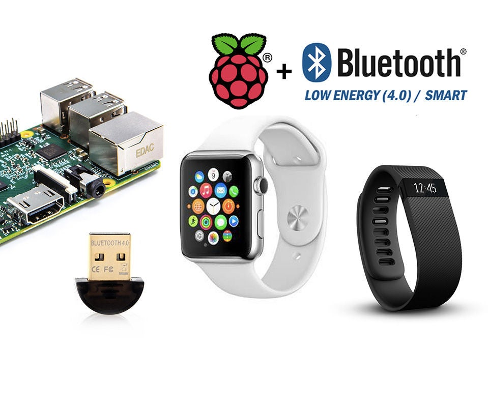

# 1. BLE on the Raspberry Pi 4

## Overview

The Raspberry Pi 4 has built-in Bluetooth hardware and can be used for Bluetooth Low Energy (BLE) work without adding a USB adapter. In this lab the Pi will act as a **BLE central/client** that scans for nearby devices and connects to the Polar H10, which acts as a **BLE peripheral/server**.

BLE is designed for low-power devices that exchange small amounts of data efficiently. That makes it a good fit for wearable sensors such as heart rate monitors.



## Key ideas

### BLE roles

In this lab, the roles are:

- **Raspberry Pi 4**: central device and GATT client
- **Polar H10**: peripheral device and GATT server

### GAP and GATT

BLE usually gets introduced through two important ideas:

- **GAP (Generic Access Profile)** describes how devices advertise, scan, and connect.
- **GATT (Generic Attribute Profile)** describes how data is organised once devices are connected.

### Linux BLE support on Raspberry Pi OS

On Raspberry Pi OS, BLE support is typically provided through:

- the Linux Bluetooth stack
- the `bluetoothd` service
- BlueZ command-line tools such as `bluetoothctl`

## Check that Bluetooth is available

Open a terminal on the Raspberry Pi and run:

```bash
bluetoothctl --version
```

You can also start the interactive tool:

```bash
bluetoothctl
```

At the `bluetoothctl` prompt, try:

```text
show
list
```

These commands let you inspect the local Bluetooth adapter.

## What you should understand before moving on

Before continuing, make sure you understand that:

- the Pi can scan for BLE devices nearby
- the Pi can connect to a BLE peripheral such as the Polar H10
- once connected, the Pi can discover services and characteristics and read or subscribe to data
