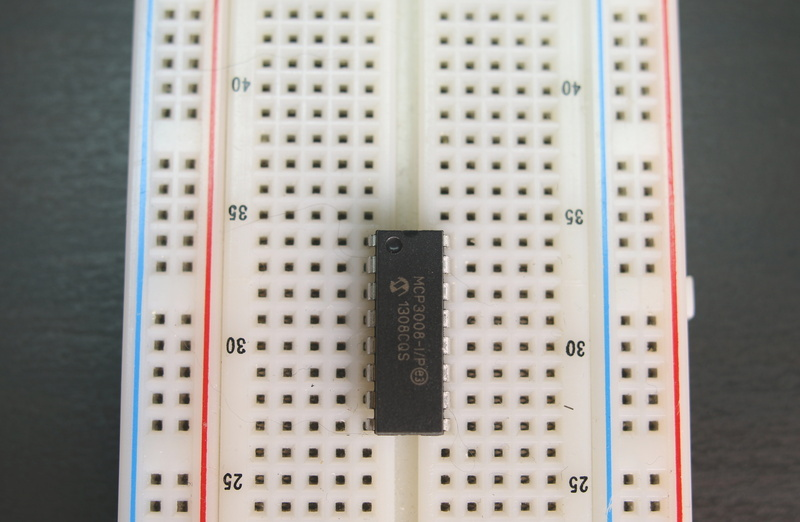
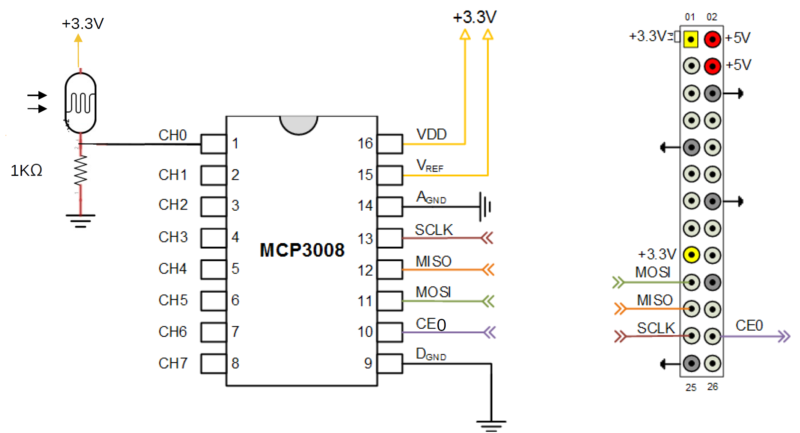
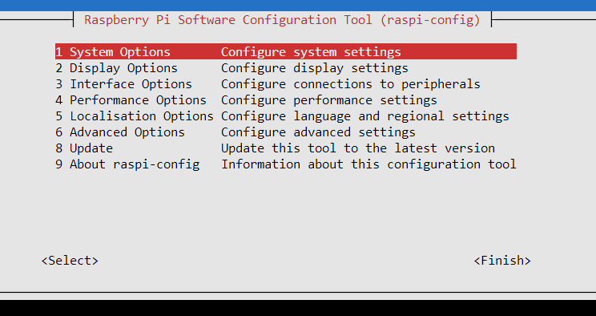
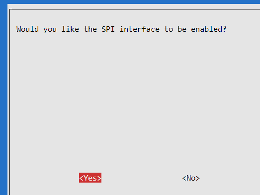

# MCP3008

In this section, you will utilize an ADC available as a discrete IC.

Insert the MCP3008 into the breadboard as shown below:





Once the MCP3008 is inserted, wire the ADC and Raspberry as shown below(if you don't have a LDR, replace with a potentiometer or equivalent sensor:



Make sure you have placed the ADC in the breadboard in the right direction. To keep track of which way is which, note the location of the half circle on one of the sides of the ADC.

### SPI on the RPi

To integrate an MCP3008 with a Raspberry Pi, you'll need to communicate using the SPI protocol. Make sure your Raspberry Pi has the SPI interface enabled. 

+ Open the Configuration Tool using the following command: `sudo raspi-config` 
  
+ Select `Interface Options` and enable SPI:
  

Exit the Configuration tool to return to the command line.


# Code:

Make sure the required python library is on the RPi. Use pip to install the spidev library as follows:

```python
pip install spidev
```


Create a new folder called *MCP* in your home folder.

Create a new file called *mcp.py* with the following content:  

~~~python
import spidev
import time

# Create SPI instance
spi = spidev.SpiDev()
spi.open(0, 0)  # Open SPI port 0, device (CS) 0
spi.max_speed_hz = 1000000  # Set clock speed to 1 MHz

def read_channel(channel):
    """
    Reads data from the specified channel of the MCP3008.
    """
    if channel < 0 or channel > 7:
        return -1
    adc = spi.xfer2([1, (8 + channel) << 4, 0])
    data = ((adc[1] & 3) << 8) + adc[2]
    return data

try:
    while True:
        value = read_channel(0)  # Change the channel number as needed
        print("Channel 0 value:", value)
        time.sleep(1)
except KeyboardInterrupt:
    spi.close()

~~~

Run the code by entering the following at the command line:


~~~
python mcp.py
~~~

You should see values appear on the command line. Alter the position of the potentiometer, you should see the different 
