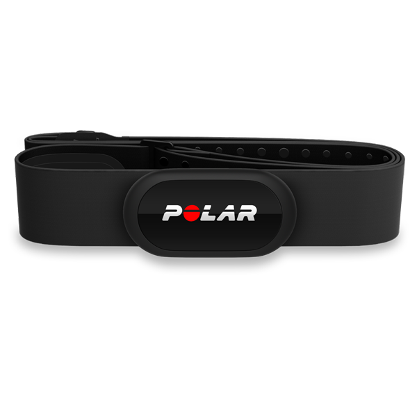

# 2. Polar H10 Heart Rate Monitor

## What is the Polar H10?

The Polar H10 is a chest-strap heart rate monitor. It measures electrical activity associated with heart beats and broadcasts heart rate data wirelessly. In this lab we will use its BLE interface.

## BLE SIG service offered by the Polar H10

The main standard BLE service we will use is the **Heart Rate Service**.

### Common standard services/characteristics you may see

The following standard BLE UUIDs are the most relevant in this lab:

#### Services

- **Heart Rate Service**: `0x180D`
- **Battery Service**: `0x180F`
- **Device Information Service**: `0x180A` (may also be present depending on firmware and how the device is queried)

#### Characteristics

- **Heart Rate Measurement**: `0x2A37`
- **Body Sensor Location**: `0x2A38`
- **Heart Rate Control Point**: `0x2A39`
- **Battery Level**: `0x2A19`

In practice, the most important characteristic for this lab is **Heart Rate Measurement (`0x2A37`)** because it can send notifications whenever the heart rate updates.

## GATT details for the Polar H10

Think of GATT as a hierarchy:

- **Service**
  - groups related data
- **Characteristic**
  - holds a value or supports notifications
- **Descriptor**
  - gives more information about a characteristic

For the H10, the key GATT idea is:

- connect to the device
- discover the Heart Rate Service
- subscribe to notifications on the Heart Rate Measurement characteristic

The heart rate value is delivered as bytes, so your program must decode the data packet.

## GAP details for the Polar H10

From a GAP point of view, the Polar H10 behaves like a BLE peripheral that:

- advertises itself periodically
- can be discovered by nearby central devices
- typically appears with a name such as `Polar H10 xxxxxxxx`
- allows a central device to connect and explore its GATT database

In a room with many devices, the device name alone may not be enough to identify your own sensor. That is why you will use the printed device ID on the side of the sensor.

## Why the printed ID matters

There may be several H10 devices visible at the same time. The printed ID helps you match:

- the physical sensor in your hand
- the advertising device name seen by the Raspberry Pi

## Challenge

Answer these questions:

1. What is the UUID for the Heart Rate Service?
2. Which characteristic do we subscribe to in order to receive live heart rate data?
3. Is the Polar H10 acting as a central or a peripheral in this lab?
