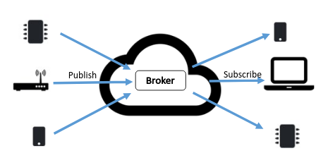

# MQTT Publish and Subscribe

Use MQTT to connect a device

## Introduction
You will use the  Raspberry Pi as a prototypical Smart Security/Environment Monitoring Device. You will publish Environment data, device detection data. It will send a current value of every sensor to a MQTT broker. There are many public MQTT brokers or you can set up your own. In this lab you can choose one of the following public brokers.

+ mqtt://iot.eclipse.org:1883
+ mqtt://broker.hivemq.com:1883
+ mqtt://test.mosquitto.org:1883
+ mqtt://broker.emqx.io:1883
+ https://www.emqx.com/en/mqtt/public-mqtt5-broker

As they are public brokers there is no guarantee of service (personally I found broker.hivemq.com slow). If you wish to have some reassurance of performance and authentication, there are several services available that offer a free tier such as [cloudmqtt](https://www.cloudmqtt.com) or you can build your own (not too difficult)

THIS LAB WAS CONSTRUCTED USING THE PUBLIC MQTT BROKER FROM EMQ https://www.emqx.io/mqtt/public-mqtt5-broker.

## Equipment, Software

+ Raspberry Pi 3B+/4B
+ SenseHAT
+ Cloud MQTT Broker
