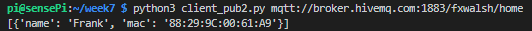

# Presence Detection

``nmap`` lists all devices (if any) connected your local network at the time the scan was executed. By scanning the local network for certain devices’ MAC addresses, we can detect their 'presence' on the network. Furthermore, if connected by WiFi, we can deduce that the physical device itself is within the range of the WiFi access point (e.g. at home).

There are various ways of finding a particular device MAC address and a quick internet search will soon let you know how to find the MAC address for the WiFi interface on your Smartphone.  

- Find and record the MAC address of your smartphones Wifi interface (or if you're not using a Smartphone,  any other device on the Wifi Network for now)

- **On the RPi**, make sure you have nmap installed:

```
sudo apt-get install nmap
```
- Find the Network IP Address and subnet mask of your RPi by entering ``ip a`` at the command line:  

- Using the IP address/subnet, scan for the presence of a device on the subnet your RPi us on by doing a 'grep' using MAC (replace the '192.168.1.0/24' with your IP/Subnet):

~~~bash
~$ $ sudo nmap -sn 192.168.1.0/24 | grep MAC
MAC Address: C8:0E:14:46:C2:C1 (AVM Audiovisuelles Marketing und Computersysteme GmbH)
MAC Address: 84:D6:D0:77:6F:60 (Amazon Technologies)
MAC Address: 00:22:61:E2:A0:50 (Frontier Silicon)
MAC Address: A0:63:91:30:C5:9B (Netgear)
MAC Address: 30:FD:38:09:8F:8C (Unknown)
...
~~~

If your device was found, the command will output its address info. If not, make sure that it’s connected to the same local WiFi network as your RPi. Smart devices are fairly energy efficient so you may also need to 'wake up' your device, as it may drop the WiFi connection if left idle for too long.

Now that we have a mechanism to detect known devices on the local network, we can write a script on the RPi/SenseHAT to indicate the presence/absence of a device. In order to access easily higher order functions on the RPi such as SenseHAT and messaging protocols, we'll now switch to using Python.

## Scanning for MAC addresses with Python
We can call ``nmap`` from a Python program using the ``subprocess`` library.

- **On the RPI**, in the ``~/mqtt`` folder you created earlier, create a new file called ``presence-detector.py`` with the following content (you will need to change the network address used in the nmap command  to match your network):

~~~python
#!/usr/bin/env python3
#coding=utf-8

import subprocess
        
# Returns the list of known devices found on the network
def find_devices():
    devices_found = subprocess.check_output("sudo nmap -sn 192.168.1.0/24 | grep MAC", shell=True)
    return(devices_found)

# Main program (prints the return of arp_scan )
def main():
    print(find_devices())

if __name__ == "__main__":
    main()
~~~

- Run the program by typing ``python3 presence_detector.py`` on the command prompt. You should see the  output printed on the console similar to the following:


Using this approach we can now get at the connected MAC address list programatically.

- To search the output for a particular MAC addresses, lets introduce a list of devices into our program. Each item in the list will contain the device owner name (``name``) and corresponding MAC addresses (``mac``).

- Place the following code just below the import statements in the presence_detector.py

```python
#dictionary of known devices 
devices = [{"name":"Franks Phone", "mac":"88:29:9C:00:61:A9"},
        {"name":"Someone Else", "mac":"xx:xx:xx:xx:xx:xx"}
        ]
```

We will now  store details of the detected devices in a log file with the date and time. We can use Python's built in ``logging`` library to do this. 

+ place the following code lust below the import statements in the presence_detector.py script
```python
import logging

logging.basicConfig(filename='presence_detector.log', level=logging.DEBUG, format='%(asctime)s %(message)s')
```

We need to update the find_devices() function to take a device list as input and search the devices on the network for a match. 

+ Replace ``find_devices()`` with the following code(**replace the IP address/subnet mask with your own):

```python
# Returns the list of known devices found on the network
def find_devices():
    output = subprocess.check_output("sudo nmap -sn 192.168.1.0/24 | grep MAC", shell=True)
    devices_found=[]
    for dev in devices:   
        if dev["mac"].lower() in str(output).lower():
            logging.info(dev["name"] + " device is present")
            devices_found.append(dev)
        else:
            logging.info(dev["name"] + " device is NOT present")
    return(devices_found)
```


Run the script again. **As before, you should add a device that is present on the local network, otherwise you'll get ``[]`` , an empty list as a result!**

+ Check the same folder as the script for the log file *presence_detector.log*. Have a look at the contents, you should see a record of what's found.

.  

Next we'll publish the presence detector result to an MQTT broker.