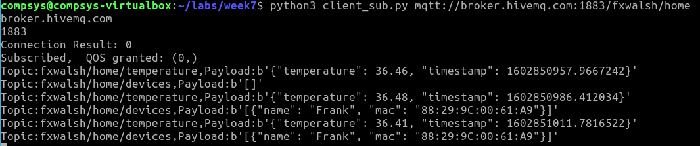

# Publishing Presence 

You already have script, *client_pub.py*, that publishes environment data. Lets update that script by importing our *presence_detector.py* and using it to also publish a new topic, /devices


+ Open *client_pub.py* and add the following to the import statements at the top of the file: 

```python
import presence_detector
```

Now update the loop at the end of the file to invoke ``presence_detector.find_devices()`` and publish the result to */devices*:

+ Add the following code into the ``while True:`` loop at the end of the file:


```python
    devices_found_json=json.dumps(presence_detector.find_devices())
    mqttc.publish(base_topic+"/devices", devices_found_json)
```

Run *client_pub.py* as before. Also, run the MQTT subscription client, *client_sub.py* on your VM. You should now see what known devices are active on your network, and consequently who's home!



## Exercises

- We should only publish to the */devices* topic if they are detected. Update the code to publish if the ``detected_devices`` list has entries.