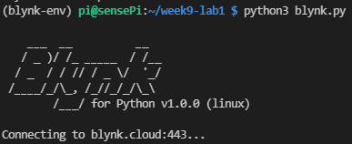

# Install Blynk Library on the Raspberry Pi 3 B+

We will use ``Python`` Blynk library to control the RPi.


## Create your Blynk App


+ SSH into your Raspberry Pi.

+ Lets make sure you have all the packages you need installed:

  ~~~bash
  sudo apt update
  ~~~
  


+ As with previous labs, make a new folder for your Blynk project and create a python virtual environment for it:

  ~~~bash
  mkdir ~/blynkLab/
  cd ~/blynkLab/
  python -m venv .venv --system-site-packages
  ~~~

+ Activate the venv:

  ```
  source .venv/bin/activate
  ```

+ At the command line, run the following to install the Blynk dependencies for Python 3

~~~text
pip install https://bit.ly/3C0PMVY
~~~

> Any time you open a **new terminal** for this project, run:
> ```
cd ~/blynkLab
source .venv/bin/activate
> ```

+ Install the library required for the Grove DHT11 sensor:

  ~~~bash
  pip install seeed-python-dht
  ~~~

### Sensor Connection

Connect the Grove temperature sensor as follows:

​	Sensor: Grove Temperature & Humidity (DHT11)  
​	Base Hat Port: **D5**

### Python Program

+ In the ``~/blynkLab/`` folder, create a new file called ``blynk.py`` with the following content:

```python
import BlynkLib, os
from time import time, sleep
from seeed_dht import DHT

# Blynk authentication token
BLYNK_AUTH = os.getenv("BLYNK_AUTH")

# Initialise the Blynk instance
blynk = BlynkLib.Blynk(BLYNK_AUTH)

# Grove DHT11 sensor on Grove Base Hat digital port D5
sensor = DHT('11', 5)

# time in seconds before process times out/shuts down
INACTIVITY_TIMEOUT = 30
blynk.last_activity = time()


# Register handler for virtual pin V1 write event
@blynk.on("V1")
def handle_v1_write(value):
    button_value = value[0]
    blynk.last_activity = time()
    print(f'Current button value: {button_value}')

    if button_value == "1":
        print("Switch ON")
    else:
        print("Switch OFF")


# Main loop
if __name__ == "__main__":
    print("Blynk application started.")

    try:
        while True:

            blynk.run()

            humidity, temperature = sensor.read()

            if temperature is not None:
                print(f"Temperature: {temperature:.1f} C")
                blynk.virtual_write(0, temperature)

            now = time()

            if now - blynk.last_activity > INACTIVITY_TIMEOUT:
                print(f"No activity for {INACTIVITY_TIMEOUT} seconds. Exiting.")
                break

            sleep(2)

    except KeyboardInterrupt:
        print("Blynk application stopped.")
```

+ You will need to set the BLYNK_AUTH environment variable on the RPi for this to run. To find the Authtoke , In Devices list,:
  
  1. select your device the then select the **Developer Tools ** icon.
  2. Locate the **Auth Token** in the banner an click it to copy."
  
  
  

+ Run the Script as follows, pasting in the Auth token you just copied where indicated:

  ~~~python
  export BLYNK_AUTH="PASTE_YOUR_AUTH_TOKEN_HERE"
  python blynk.py
  ~~~

  


The above script creates a ``Virtual Pin`` on your Raspberry Pi. You can use this to interface, display and send data with your Blynk app on your phone.

+ Run the script by opening a terminal window and entering ``python blynk.py`` at the command line. You should see the following output:



+ Leave the program running on the RPi 

+ Go back to the Blynk Management App in the browser and select the "Dashboard" tab. Toggle the button control a few times on the Dashboard. You should see the values come through on the RPi. You can now control stuff on the RPi from this dashboard, from any browser, if you wish!
  
  
  

