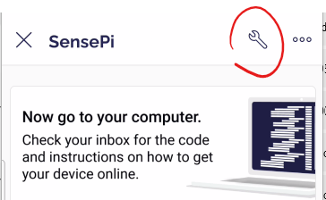
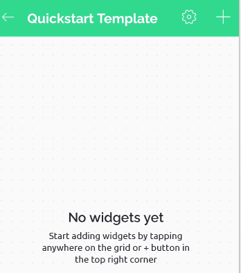

# Install/Set Up Blynk App

So now lets send commands from an app on your phone to the Raspberry Pi using Blynk. You will need the Blynk app on an **Android** or **Apple IoS** device such as a Smart Phone or Tablet. If you don't have a device available to do this, you can [emulate Android on your desktop](https://community.blynk.cc/t/blynk-desktop-app-android-emulator/13968).

+ Install the **Blynk IoT** App for your Smartphone.  Access it on the relevant app store for your device.
  

Once installed, use the app to do the following:

+ Log in to your Blynk account that you set up in the last step.
+ Once logged in you should see the SensePi, the device you just created in the last step:
  
+ Click on the **SensePi** device to open the Mobile Dashboard. You'll see this:
  
+ **Ignore the message "Now go to your computer..."**.  Click on the Button and, if the python program is still running on your RPi, you'll be able to control the LED array on the SenseHAT using the button.

## Update the QuickStart template

+ Click on the wrench icon to edit the template for the app.  

  

+ You should see a "help" dialog. It's worth swiping through this to get info on how widgets work.

+ Click on the "Now go to your computer" widget to open its settings and delete it by clicking the "bin" icon in the top right corner:

  

+ Do the same for all other widgets on the Template (Uptime, Button Value, Button). You should be left with an empty template with a "No Widgets yet" message...
  

## Add a Button Widget

 Now lets add a switch widget to control the LEDs on the RPi

+ Click on the ``+`` icon in the menu to open the ``Widget box`` and select the Button widget
  

You should now see it on the Template.

+ Tap on it to open the Button settings

+ In Data, set the Datastream to Switch Control (V0). In settings, set the Mode to Switch as shown below. 
  

+ Select the design icon at the bottom left corner and set the Title to LEDs and alignment to centre:

+ Hit the ``X`` in the top left to exit the button settings,. You should now see the new button on the template. Exit the template to return to the App screen.
  

+ Make sure the Blynk program is still running on your RPi to make sure it's online(**NOTE: it may go offline if not used for a while**).

+ Click the button on your phone app. You should now see the LEDs turn on/off accordingly. 

  

You can now connect and control your RPi from your phone from anywhere via the internet. To confirm this, you can turn off the Wifi on your phone and use the  data from your phone network - it should still work.