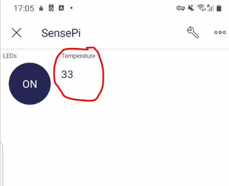

# Get data from the RPi to your phone 

We'll now send data from the RPi  to the Blynk Mobile app. You will need to update the Template we are using for the device. 

## Update Template

Up now you have been using the "Quickstart Template" for our device. You will modify this template to enable the Blynk Mobile App access temperature and other data from the SensePi.

+ Log into the [Blynk.Console](https://blynk.cloud/) 
+ Select "templates" and then the "Quickstart Template"
  
+ Click on the "edit" button in the top-right corner.
+ In the *info* tab, change the template name to "SensePi Template"
  
+ Select the "DataStreams" tab and do the following.
  + Delete the data streams with id = 3 and 4. 
  + Click on datastream id=2 (Switch value) and update the configuration as shown in the image below
    
+ Click on "Save and Apply" in the top-right corner to save the new settings.(if prompted before save, select "update 1 active device" )

### Update Phone App

+ On your phone, open the Blynk app and select the  SensePi device. Click on the wrench in the top-right corner to edit the Mobile Dashboard.
+ Open the *Widget Box*, scroll down to the displays section and  and add a *Value Display* 
  
+ Click on the Value Display widget and configure it to display temperature and  by attaching it to the  Temperature DataStream as shown:
  
+ In the Design tab, set the title to Temperature.


+ Exit back out to the App as before using the back button in top left corner.

### Update Blynk Python program on RPi 

+ Now, on the Raspberry Pi, in ``blynk.py``, add one line of code to write the temperature to virtual pin 1 (V1) and the temperature datastream. The line if code is shown below:

```python
while True:
    blynk.run()
    blynk.virtual_write(1, round(sense.temperature,2)) #ADD THIS LINE!!!
    time.sleep(.5)
```


+ Now run the blynk python app on the RPi as before.

  ### Temperature on Phone

  Now open the the Blynk app on your phone again, you should now see live temperature data. 
  

+ Select the ``Button`` and it should appear on your project


## Exercise:

Referencing the previous steps, try some of the following steps:

+ Display Temperature using a **Gauge** and **SuperChart** widgets. 
+ Display Pressure/Humidity data on the Blynk App
  
