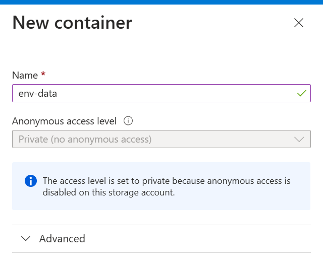

# Azure IoT Storage & Visualisation

Sending telemetry from a Python script to Azure IoT Hub.

In this lab you will also automatically routing it to Blob Storage, and visualizing it using `pandas` and `matplotlib`.

---

### 🧱 1. Create a Blob Container in Azure

1. Go to your Azure **Storage Account**
2. Navigate to **Containers**
3. Click **+ Container**
4. Name it (e.g., `env-data`)
5. Set Public access level to **Private**

