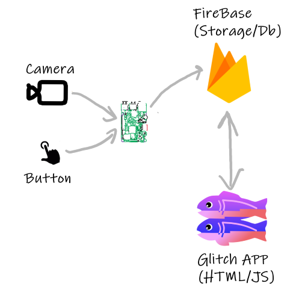

# Image Storage and Notification

Develop an event-driven smart doorbell prototype using Rpi, Firebase, and Glitch.

## Introduction:

In class, we discussed email as a channel to send images when the doorbell is pressed. While it is a good solution, it has some drawbacks:

+ You need to access to an Email client to view the image. The notification email may end up buried in other emails.
+ The application on the Raspberry Pi is "tightly coupled" to the email service. Should you wish to change/add notification channel(such as SMS/push notifications) or process, you need to update the code on the device. Not easy if it is deployed in the field.
+ The images are stored on the Raspberry Pi. While this is fine, there is limited space on the RPi and it might be more useful to store any images on a cloud service. This would also allow other connected applications use and display the images.

We will change the overall architecture of the Smart Doorbell to be "Event-Driven". We can use the broker topology similar to what used with MQTT to do this. This time however, when a doorbell "event" occurs, we publish that event to Firebase. Other things/processes that might be interested can then "subscribe" or watch for events. In this case, we will develop a basic Web App in glitch that will update the image every time a new doorbell event occurs. 

## Equipment/prerequisites:

+ Button part of the Circuit from last weeks lab.(you can leave the LED part however we will be needing it.)
+ Raspberry Pi 3B+
+ Google Account/ID and Glitch account