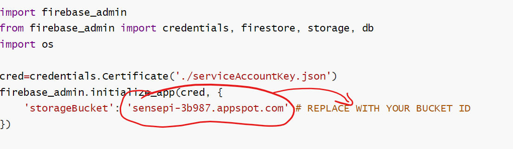
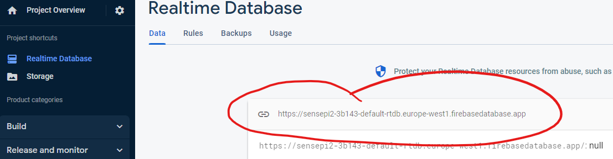
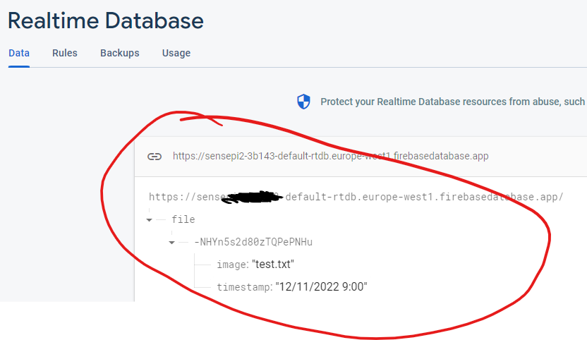

# Store File 

You need to write a program that can:  
1. Upload an image file to Firebase Storage
2. Push a message to the Firebase Realtime Database

In order to do this, you will need to make the FireBase credentials for your SensePi project available on the RPi.

## Install Firebase-Admin

The Firebase Admin SDK provides APIs for authentication, Realtime Database, and Storage.
+ On the Raspberry Pi, install the Firebase Admin package, version 5.4.0, as follows:

```
pip install firebase-admin==5.4.0
```

## Firebase Credentials

 You need to register your app with Firebase so that your program to have access to the Firebase "Sensepi" project credentials. We will be creating a Web App (using Glitch) so we now will create an app for a Web Application. 
We can use this to get the Firebase json file with the required keys for your python program.

+ Go to you FireBase *Project Overview* page  and click on the *Web* app icon:  
  
+ Give the the name *RPiCamApp* and click register App  
  
  + Click on *Continue to Console*
+ Now in  Project Overview page, click on the "1 app" and then settings option for the *RPiCamApp*.  
  
+ Select the *Service Accounts* tab and select python and then  *Generate new private key*  
  
+ Save the file to a safe place on your computer as *serviceAccountKey.json*.


## Store File 

+ On the Raspberry Pi, create a new folder in the home folder called *week10*
+ Create a copy the *serviceAccountKey.json* file in this folder. One way to do this over SSH is to create a file with the same name and copy the contents into it(if you use VS Code with Remote SSH, you can just drag/drop it!). 
+ Create an empty file called *test.txt* in the *week10* folder. You will use this file to test file storage functionality.
+ On the RPi, in the *week10* folder, create a file called *storeFileFB.py* with the following contents:

```python
import firebase_admin
from firebase_admin import credentials, firestore, storage, db
import os

cred=credentials.Certificate('./serviceAccountKey.json')
firebase_admin.initialize_app(cred, {
    'storageBucket': 'sensepi-3b987.appspot.com' # REPLACE WITH YOUR BUCKET ID
})

bucket = storage.bucket()

def store_file(fileLoc):

    filename=os.path.basename(fileLoc)

    # Store File in FB Bucket
    blob = bucket.blob(filename)
    outfile=fileLoc
    blob.upload_from_filename(outfile)


if __name__ == "__main__":
    f = open("./test.txt", "w")
    f.write("a demo upload file to test Firebase Storage")
    f.close()
    store_file('./test.txt')
```
+ In the Firebase console, go to your Storage and copy the bucket ID of your Storage, 
  
+ In  *storeFileFB.py*, replace the value for `storageBucket` where indicated  **and remove the "gs://" part at the start** . It will look something like "sensepi-5l324.appspot.com''. See below for a guide:
  

## Test File Storage

+ Run the program using ``python storeFileFB.py`` and then check your Storage, you should see the test file created in the main program uploaded to Storage(**you may need to refresh the Storage page in the browser**).
  

## Push to Realtime DB

We will use the Realtime DB to notify apps that a new file has been stored on Firebase.

+ In the Firebase console, go to your Realtime Database and copy the URL of your DB:  
  

+ On the RPi in week10 folder, Open *storeFileFB.py* and update the ``firebase_admin.initialiseApp(...)`` statement to include the database, using the URL from the last step:  
```python
...
firebase_admin.initialize_app(cred, {
    'storageBucket': 'YOUR_ID.appspot.com',
    'databaseURL': 'https://YOUR_DB_URL.com/'
})
...
```

+ Before the ``def store_file(..)`` function, add the following code:  
```python
  ref = db.reference('/')
  home_ref = ref.child('file')
```

+ Add the following function just before the ``if __name__ == ...`` statement:

```python
def push_db(fileLoc, time):

  filename=os.path.basename(fileLoc)

  # Push file reference to image in Realtime DB
  home_ref.push({
      'image': filename,
      'timestamp': time}
  )

```

+ Replace the whole  ``if __name__ == "__main__":`` statement with the following:

```python
if __name__ == "__main__":
    f = open("./test.txt", "w")
    f.write("a demo upload file to test Firebase Storage")
    f.close()
    store_file('./test.txt')
    push_db('./test.txt', '12/11/2020 9:00' )
```

+ Run the program again using ``python storeFileFB.py``. Check your Realtime DB in Firebase, you should see a new record under file:
  

You will now integrate this package with your work from last week. 


## Final Code

After all the above steps, the program should be as follows, replacing the ``storageBucket`` and ``databaseURL`` with your own values:

```python
import firebase_admin
from firebase_admin import credentials, firestore, storage, db
import os

cred=credentials.Certificate('./serviceAccountKey.json')
firebase_admin.initialize_app(cred, {
    'storageBucket': 'test-b4c8f.appspot.com',
    'databaseURL':'https://test-b4c8f.firebaseio.com/'
})

bucket = storage.bucket()

ref = db.reference('/')
home_ref = ref.child('file')

#Uploades file to Fb Storage
def store_file(fileLoc):
    filename=os.path.basename(fileLoc)
    blob = bucket.blob(filename) # Store File in Fb Bucket
    blob.upload_from_filename(fileLoc)

#Pushes File name to Fb Realtime DB
def push_db(fileLoc, time):

    filename=os.path.basename(fileLoc)

    # Push file reference to image in Realtime DB
    home_ref.push({
        'image': filename,
        'timestamp': time}
    )

if __name__ == "__main__":
    f = open("./test.txt", "w")
    f.write("a demo upload file to test Firebase Storage")
    f.close()
    store_file('./test.txt')
    push_db('./test.txt', '12/11/2020 9:00' )
```