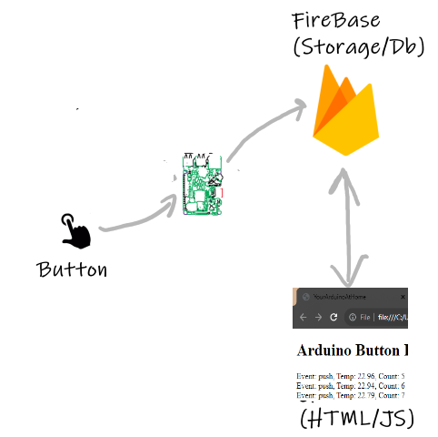

# Button Event Logging and Notification

Develop an event driven smart doorbell using an Arduino, Firebase, and a Web App.

## Introduction:

This lab shows how to write to the Firebase Realtime DB from an Arduino when an "event" occurs. in this case, it will be a button press. 

## Equipment/prerequisites:

+ Arduino and IoT Carrier(from Explore IoT kit) 
+ Google Account/ID