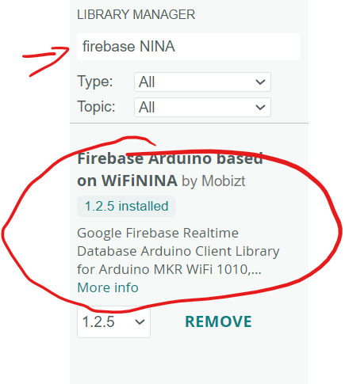
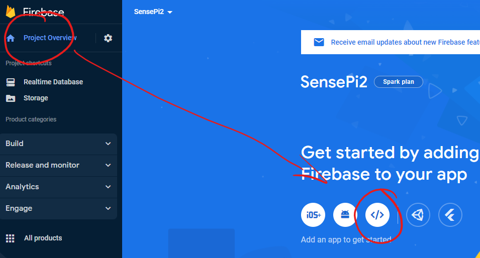
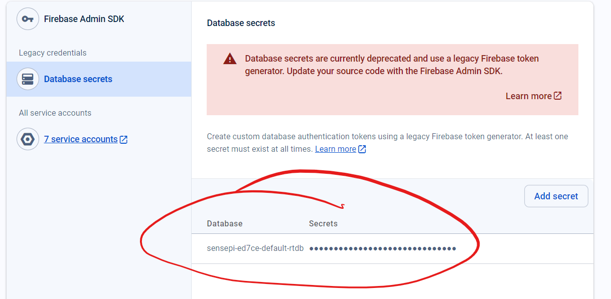

# Arduino Firebase integration

You need to write a program that can:  
1. Detect a button press
2. Push a message to the Firebase Realtime Database

In order to do this, you will need to make the FireBase credentials.

## Install Arduino Firebase Library for WifiNINA

In the Library Manager, install Firebase Arduino based on WiFiNINA:



## Firebase Credentials

You need to register an app with Firebase so that your program to have access to the Firebase project credentials. We will be creating a Web App so we now will create an app for a Web Application. 
We can use this to get the Firebase json file with the required keys for your python program.

+ 
+ Give the the name *RPiCamApp* and click register App  
  
  + Click on *Continue to Console*
+ Now in  Project Overview page, click on the "1 app" and then settings option for the *app*.  
  
+ Select the *Service Accounts* tab and select Database Secrets and then  Copy the Database Secret Key (you can ignore the warning)
  
+ Paste the key into a temporary file for now. 


## Push to Realtime DB

We will use the Realtime DB to store events and notify apps that a new file has been stored on Firebase.

+ In the **Firebase console**, go to your Realtime Database and copy the URL of your DB:  
  

+ Paste the following code into your Arduino Program. Update the code with your wifi and Firebase credentials as indicated. F**or the DATABASE_URL, use the URL from the last step and remove the "https:// " from the front ,**

```c++
#include "Firebase_Arduino_WiFiNINA.h"
#include <Arduino_MKRIoTCarrier.h>
MKRIoTCarrier carrier;
#define DATABASE_URL "YOUR_DATABASE_URL"  //  <databaseName>.<region>.firebasedatabase.app
#define DATABASE_SECRET "YOUR_DB_SECRET_FROM_FIREBASE"
#define WIFI_SSID "YOUR_WIFI_SSID"
#define WIFI_PASSWORD "YOUR"

//Define Firebase data object
FirebaseData fbdo;
const long interval = 5000;
unsigned long previousMillis = millis();
unsigned long currentMillis = millis();
int count = 0;

void setup() {

  Serial.begin(9600);
  delay(100);
  Serial.println();

  Serial.print("Connecting to Wi-Fi");
  int status = WL_IDLE_STATUS;
  while (status != WL_CONNECTED) {
    status = WiFi.begin(WIFI_SSID, WIFI_PASSWORD);
    Serial.print(".");
    delay(100);
  }
  Serial.print("Connected with IP: ");
  Serial.println(WiFi.localIP());
  //Provide the autntication data
  Firebase.begin(DATABASE_URL, DATABASE_SECRET, WIFI_SSID, WIFI_PASSWORD);
  Firebase.reconnectWiFi(true);


  // clear internal memory used

  //Init everything and outputs the errors
  carrier.withCase();
  carrier.Buttons.updateConfig(100, TOUCH0);
  carrier.begin();
  carrier.display.fillScreen(0x07E0);
}

void loop() {
  // updates buttons status
  carrier.Buttons.update();
  // Checks if button 00 is touched
  if (carrier.Buttons.onTouchDown(TOUCH0)) {
    currentMillis = millis();
    Serial.println("Button 0 pressed down!");
  }

  if (currentMillis - previousMillis >= interval) {
    // save the last time a message was sent
    previousMillis = currentMillis;
    Serial.println("Sending message: ");
    sendMessage();
    Serial.println();
    count++;
  }
}


void sendMessage() {
  // send message, the Print interface can be used to set the message contents
  String path = "/events";
  String jsonStr;
  float temperature = carrier.Env.readTemperature();
  Serial.println("Pushing json... ");
  // Constuct JSON string. the \" is used to escape the double quote so that it  treats the double quote as part of the string
  jsonStr = "{\"event\":\"push\",\"temperature\":"+ String(temperature) + ",\"count\":"+ String(count) + "}";
  Serial.println(jsonStr);
  if (Firebase.pushJSON(fbdo, path + "/button", jsonStr)) {
    Serial.println("path: " + fbdo.dataPath());
  } else {
    Serial.println("error, " + fbdo.errorReason());
  }
  fbdo.clear();
  carrier.display.fillScreen(0xF800);
  delay(3000);
  carrier.display.fillScreen(0x07E0);
}

```

+ Run your program. You should now be able to press Button0 on the carrier and see the data appear in the RTDB. NOTE: the above code is for the button in the case. It sometimes takes a while for the sensor to "Burn In" so you may need to cover the button0 with your hand.  The Screen will turn "Red" when the button is "pressed".
+ Have  a look at the RTDB - you should see the data...

