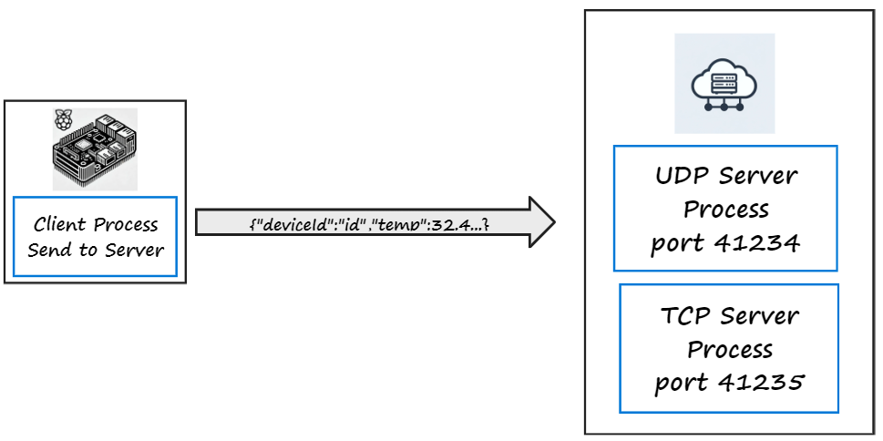

# Part 2: The Raspberry Pi Sensor

In this part, you will extend last weeks lab that investigated communication for a prototype *Smart Environment* communication scenario. Using the Raspberry Pi, you will implement a prototype sensor that sends real data to the server processes. 

## Objectives

+ Write a Python module that  extracts sensor data from a SenseHAT using Python
+ write a Python program that sends Environmental data to a server
+ Physically indicate connection state using LEDs

### Scenario

Again, let’s assume we're prototyping the communication function of a smart environment infrastructure for monitoring temperature and humidity at several locations (in this case, our prototype sensor device will be a simulated device).

+ The sensor device(in this case, your Raspberry Pi) sends data messages to a process on the **Server Host** that processes the data and stores it for analysis. 
+ The Raspberry Pi is configured to send the data at a specific interval(e.g. every 5 seconds). 



### Data Messages

The data sent by the Raspberry Pi will be sources from the SenseHAT and assembled in the  format shown in the following example:

 `{"deviceID": "Device1", "temp": 36.32, "humidity": 37.44}`

We are sending 3 data items here:

+ **deviceID:** The unique ID of the device (remember we could have many devices)
+ **temp:** Temperature in C
+ **humidity:** The relative humidity


### Device Configuration

The following configuration parameters will be used on each device to send sensor data  to the server

+ **IP Address** of Server host
+ Server process **Port Number** (we need this in the transport layer)
+ A unique **DeviceID** to be included in the data messages(your student ID)
+ Transmission interval: the time, in seconds, between each transmission

### Environmental Data

In the last lab, you implemented a Python program that used the SenseHAT to get temperature data. You will now extend that to create a small Python module that collects environmental data and returns it as a Python dictionary type. 

+ On the Raspberry Pi, in your home folder, create a new folder called **week8-lab2** if you have not already done so.
+ In this folder create a new file called *env_data.py* with the following content:

~~~python
from sense_hat import SenseHat

def get_environmental_data(deviceID):
    # Initialize SenseHAT
    sense = SenseHat()
    
    # Retrieve temperature and humidity
    temp = sense.get_temperature()
    humidity = sense.get_humidity()
    
    # Create a dictionary
    data = {
        "deviceID": deviceID,
        "temp": round(temp, 2),
        "humidity": round(humidity, 2)
    }
    
    return data

# Allow standalone testing of this module
if __name__ == "__main__":
    # Example device ID and usage
    deviceID = "myDevice1"
    environmental_data = get_environmental_data(deviceID)
    # Print the data in JSON format for testing
    print(environmental_data)
~~~


+ Run the program - it should work as follows:

````cmd
:~/week8-lab2 $ python env_data.py
{'deviceID': 'myDevice1', 'temp': 32.18, 'humidity': 55.56}
````


Take time to examine this code and, based on the accompanying lecture, understand how it works:

+ The function   ``get_environmental_data(deviceID)..`` takes one parameter, deviceID
+ Temperature and Humidity is retrieved from the SenseHAT
+ The variable ``data`` is assigned a dictionary containing the sensor data and deviceID
+ The function returns the data variable

The `if __name__ == "__main__":` conditional statement checks whether the file is being run directly or imported as a module in another file. 

+ When  you run the file directly (e.g., `python env_data.py`), the `__name__` variable is set to `"__main__"`, and any code inside the `if __name__ == "__main__":` block will execute. 
+ When we  import this file in another program (e.g., `import env_data`), the `__name__` variable is set to the module’s name (`"env_data"` in this case). This means that any code inside the `if __name__ == "__main__":` block will not execute.

We can put example or test code in the `if __name__ == "__main__":` section to check if the function works correctly when running `env_data.py` on its own.

## TCP Server Process 

You will now complete a similar client to last weeks lab using Python.

Lets check the Server host is still accessible responding by pinging it's IP address. On your Raspberry Pi, open a terminal and ping the server:

~~~
$ ping 172.236.30.12
PING 172.236.30.12 (172.236.30.12) 56(84) bytes of data.
64 bytes from 172.236.30.12: icmp_seq=1 ttl=48 time=21.6 ms
64 bytes from 172.236.30.12: icmp_seq=2 ttl=48 time=20.9 ms
64 bytes from 172.236.30.12: icmp_seq=3 ttl=48 time=20.7 ms
64 bytes from 172.236.30.12: icmp_seq=4 ttl=48 time=21.7 ms
64 bytes from 172.236.30.12: icmp_seq=5 ttl=48 time=20.5 ms
64 bytes from 172.236.30.12: icmp_seq=6 ttl=48 time=36.8 ms
~~~

If you are not getting a response from the server, it could be that server process has stopped responding or your local configuration is blocking the ICMP traffic generated by the ping command. If so, check with your class to see if anybody else is having the same issue...

+ Stop the Pinging by entering  ``ctrl+c`` in the terminal. 

### TCP Client - Python

+ In folder week8-lab2, create another python file called tcp_client.py with the following content

~~~python
import socket
from time import sleep
from sense_hat import SenseHat
from env_data import get_environmental_data

deviceID = "device1"
interval = 5

# Create SenseHAT object (used to access temp sensor)
sense = SenseHat()
#UDP Client configuration parameters
serverAddressPort = ("172.236.30.12",41235)

# create a socket object
tcp_socket = socket.socket(
                socket.AF_INET, socket.SOCK_STREAM) 

# bind the socket object to the port
tcp_socket.connect(serverAddressPort)
while True:
    msgFromClient = get_environmental_data(deviceID)
    bytesToSend = str(msgFromClient).encode()
    tcp_socket.sendall(bytesToSend)
    print(f"Sent to server {msgFromClient}")
    sleep(interval)
~~~

+ Run the above server - you should see confirmation messages that the data is being sent to the server. 


### Exercise

Without the connection to the RPi, there's no way of knowing the state of the Sensor(it is either Connected, Not Connected, Off).

+ Update the above program to change the LED matrix colour to Red when the program starts. 
+ After the connection, turn the LED matrix to Green. This should happen after the tcp.connect(..) statement. 
