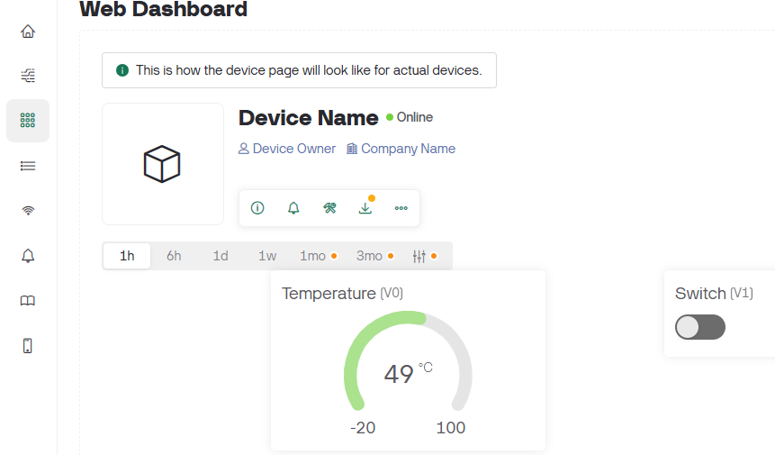

## Create New Template

In Blynk, a Device Template is  a set of configurations. Once you have created a template, you can create one or many devices from this template and they will inherit all of the same configurations. Although you will only use one device in this exercise,  templates make it easy to deploy multiple devices that perform the same functions.

You will now create a template for your Raspberry Pi.

+ In Blynk.Console, go to the "Templates" section.

+ Click the "+ New Template" button.  

+ Enter "SensePi" as the name for your template and specify the hardware and connectivity type you'll be using.

+ Click "Done" to create the template.  

   

   

+ Click "Done" and  you'll be directed to its settings. 
  

+ Leave this page open in the browser, you'll need it in the next step...

### Temperature Data Stream

A Datastream is used to transfer data between your device and the Blynk cloud. To do this correctly, Blynk.Cloud needs to know what kind of data is being transferred. It also helps when visualising/praccessing data. 

You will now create 2 datastreams, one for temperature data(in celcius) and one for a switch (on/off).

#### Temperature

+ In the Blynk.Console, select the SensePi Template from the last step. 
+ Select the DataStreams option
  

+ Select the "New Datastream" option/button and select "Virtual Pin" option:

+ You should now see the New Datastream dialog. Complete the fields as shown below and click "Create":

#### Switch DataStream 

+ Create another data stream by following the same  process as above. This time configuring the stream as shown below:

### Web Dashboard

+ For the same template, Select the Web Dashboard option. 
+ Click on the Edit button to add widgets to your dashboard.
+ From the widget list, scroll down to find a Gauge and drag onto the dashboard:
+ 
+ Click on the "gears" icon to bind it to the Temperature Datastream:
   

+ Now add a Switch widget and, using the same process,  configure it to use the switch datastream:

+ Click "Save and Apply" when done. 

Your SensePi template should now have a simple dashboard as follows:

### Add Device

+ select Devices in the BLynk Console

+ Select New Device and then From Template:

  

+ Select the SensePi Template you have laready created. (it should appear in the drop down)

+ Accept the default name and click create. 

  

  You now have a Device configuration that you can use on the Raspberry Pi to interact with the Blynk.Cloudp.
