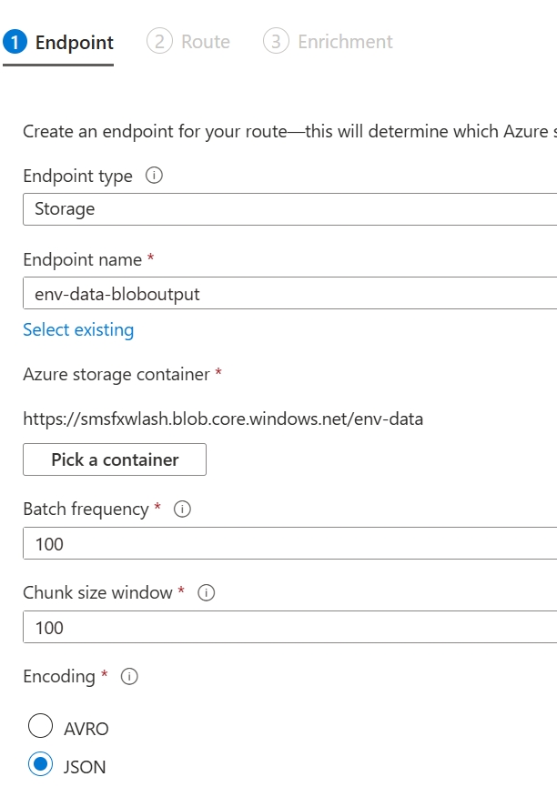
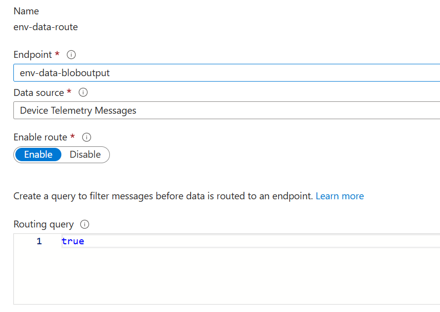

# Azure IoT → Blob Storage → Python Visualisation

Sending telemetry from a Python script to Azure IoT Hub.

In this lab you will also automatically routing it to Blob Storage, and visualizing it using `pandas` and `matplotlib`.

---

## 🧱 1. Create a Blob Container in Azure

1. Go to your Azure **Storage Account**
2. Navigate to **Containers**
3. Click **+ Container**
4. Name it (e.g., `env-data`)
5. Set Public access level to **Private**


---

## 🚦 2. Route IoT Hub Telemetry to the Blob

### Step A: Get Storage Connection String

1. In your **Storage Account**, go to **Security + Networking -> Access Keys**
2. Copy the **Connection String** for key 1.

### Step B: Add Storage Endpoint in IoT Hub

1. Open your **IoT Hub**
2. Go to **Message Routing > Custom Endpoints**
3. Click **+ Add**
4. Choose **Storage** as Endpoint type
5. Enter:
   - Name: `env-data-bloboutput`
   - Connection string: *paste from above*
   - Click Pick a Container and select the container you created in the last step
   - Encoding: **JSON**



6. Click **Next** to configure the Route
7. Enter:
   1. Name: **env-data-route**
   2. Source: **Device Telemetry Messages**

### Step C: Add a Route

1. Go to **Message Routing > Routes**
2. Click **+ Add**
3. Name: `sendToBlob`
4. Source: **Device Telemetry Messages**
5. Endpoint: **bloboutput**
6. Query: `true` (default)
7. Save
   

---

## 🐍 3. Send Simulated Telemetry from Python

Install dependencies:
```bash
pip install azure-iot-device
```

Example `iot_send.py`:

```python
import random
import json
import time
from datetime import datetime
from azure.iot.device import IoTHubDeviceClient, Message

connection_string = "your-iot-hub-device-connection-string"

def get_env_data():
    return {
        "timestamp": datetime.utcnow().isoformat(),
        "temperature": round(random.uniform(15, 30), 2),
        "humidity": round(random.uniform(30, 80), 2),
        "pressure": round(random.uniform(980, 1050), 2)
    }

device_client = IoTHubDeviceClient.create_from_connection_string(connection_string)
device_client.connect()

try:
    while True:
        data = get_env_data()
        message = Message(json.dumps(data))
        device_client.send_message(message)
        print("Sent:", data)
        time.sleep(1)
except KeyboardInterrupt:
    device_client.shutdown()
```

---

## 📊 4. View and Plot Data Using Pandas

Install dependencies:
```bash
pip install azure-storage-blob pandas matplotlib
```

Example `plot_data.py`:

```python
import base64
import json
import pandas as pd
import matplotlib.pyplot as plt
from azure.storage.blob import ContainerClient

connect_str = "your-storage-account-connection-string"
container_name = "your-blob-container-name"

client = ContainerClient.from_connection_string(connect_str, container_name)
records = []

for blob in client.list_blobs():
    blob_data = client.download_blob(blob).readall()
    lines = blob_data.decode('utf-8').splitlines()
    for line in lines:
        try:
            msg = json.loads(line)
            body = msg.get("Body")
            if body:
                decoded = json.loads(base64.b64decode(body).decode('utf-8'))
                records.append({
                    "timestamp": pd.to_datetime(decoded.get("timestamp", msg.get("EnqueuedTimeUtc"))),
                    "temperature": decoded.get("temperature")
                })
        except Exception as e:
            print(f"Skipped line: {e}")

df = pd.DataFrame(records)

if not df.empty:
    df.sort_values("timestamp", inplace=True)
    plt.plot(df["timestamp"], df["temperature"], marker='o')
    plt.title("Temperature Over Time")
    plt.xlabel("Time")
    plt.ylabel("Temperature (°C)")
    plt.grid(True)
    plt.tight_layout()
    plt.show()
else:
    print("No data to plot.")
```

---

## ✅ Result

- Realistic sensor data is sent to Azure IoT Hub
- Automatically routed to Azure Blob Storage
- Downloaded and visualized using Python

---
